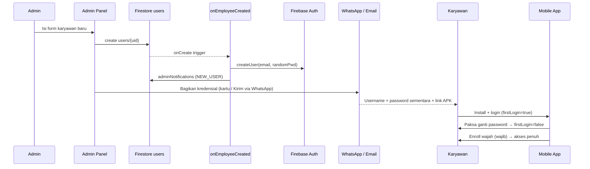
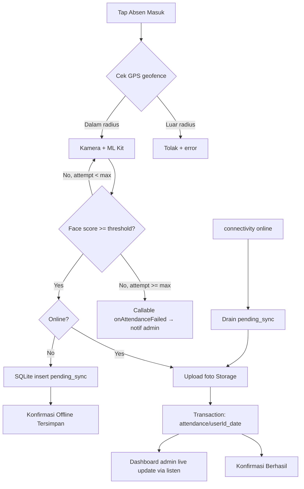
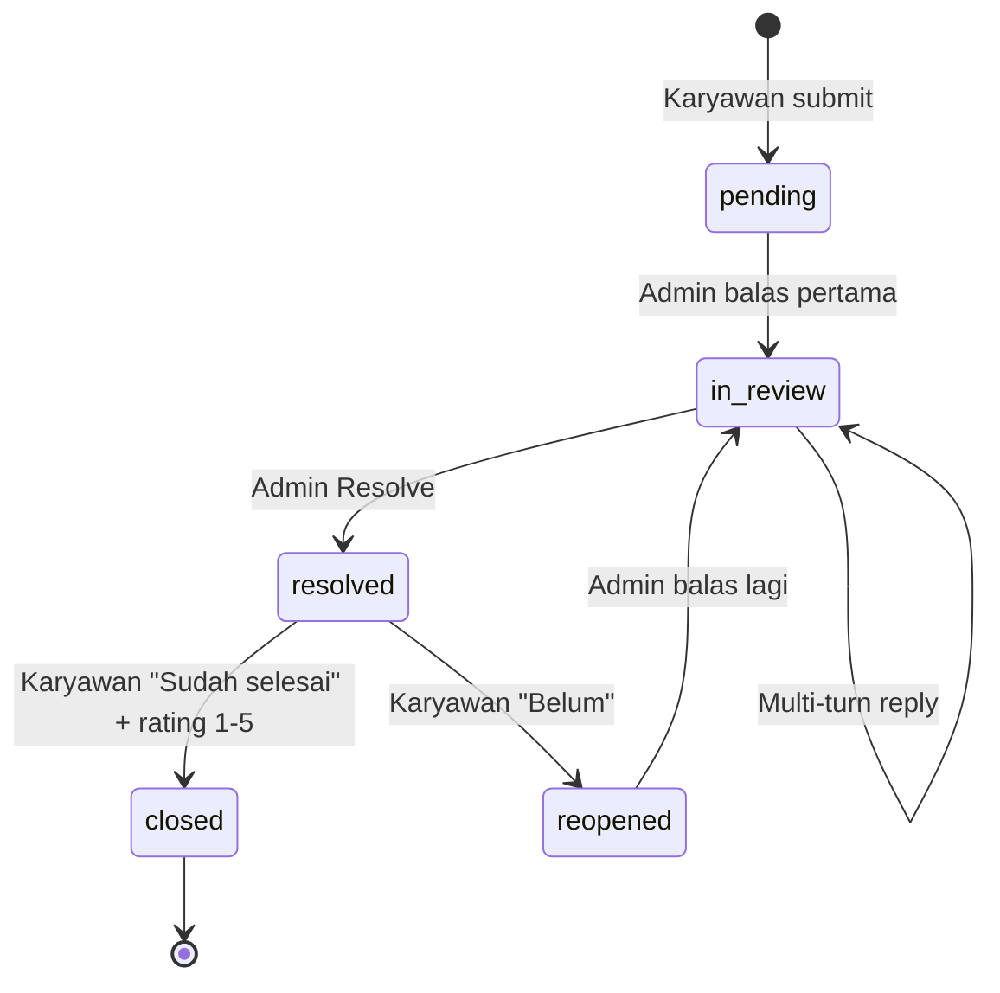
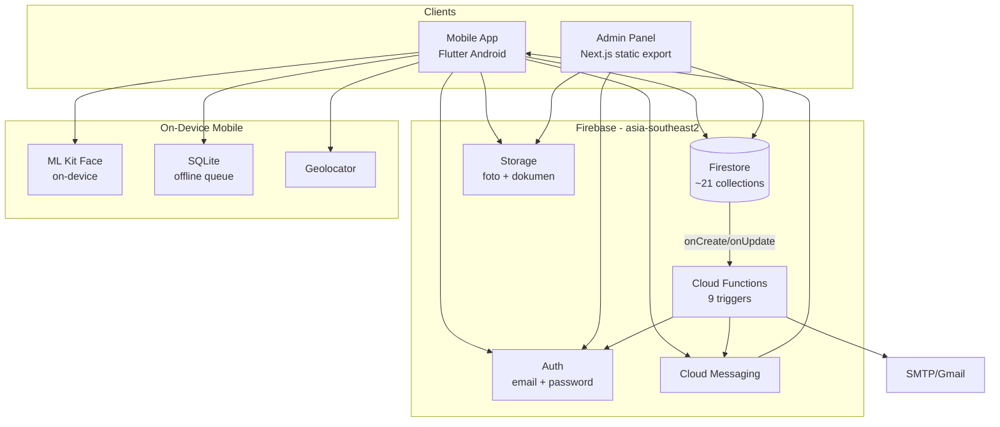
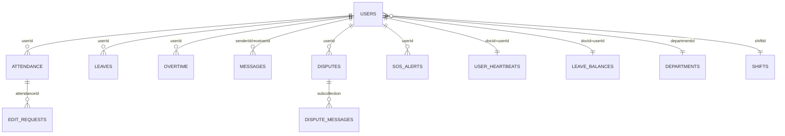

# JNE Attendance System — Dokumen Produk Lengkap (Master)

> Dokumen tunggal & self-contained untuk **JNE Attendance System** (JNE Absensi MTP) — sistem absensi karyawan berbasis **Face Recognition on-device + Geofence GPS** untuk JNE Hub Martapura, Kalimantan Selatan. Berisi seluruh aspek produk: identitas, masalah & solusi, fitur, alur, arsitektur, model data field-level, Cloud Functions, API, keamanan, QA, go-live, panduan pengguna, analisis biaya, dan roadmap. Semua dokumen lain (`PRD.md`, `SDD.md`, `FIRESTORE_SCHEMA.md`, `QA_AUDIT.md`, `GO_LIVE_CHECKLIST.md`, `PANDUAN_KURIR.md`, `project.md`) dirangkum di sini.

| | |
| --- | --- |
| **Nama produk** | JNE Attendance System (JNE Absensi MTP) |
| **Versi dokumen** | 1.0 (master) |
| **Tanggal** | 1 Juli 2026 |
| **Author** | Zainul Arkaan |
| **Status produk** | Production Live — terverifikasi go-live |
| **Versi aplikasi** | 1.0.0 (build 7), auto-update aktif |
| **Firebase project** | `admin-absensi-jne-mtp` · region `asia-southeast2` (Jakarta) |

---

## Daftar Isi

**Bagian I — Produk & Bisnis**
1. [Identitas & Metadata Proyek](#1-identitas--metadata-proyek)
2. [Ringkasan Eksekutif](#2-ringkasan-eksekutif)
3. [Latar Belakang & Problem Statement](#3-latar-belakang--problem-statement)
4. [Masalah → Solusi](#4-masalah--solusi)
5. [Target Pengguna (Persona)](#5-target-pengguna-persona)
6. [Proposisi Nilai & Pembeda](#6-proposisi-nilai--pembeda)
7. [Transformasi Operasional](#7-transformasi-operasional)

**Bagian II — Fitur & Pengalaman**
8. [Komponen Produk](#8-komponen-produk)
9. [Katalog Fitur — Aplikasi Karyawan (Mobile)](#9-katalog-fitur--aplikasi-karyawan-mobile)
10. [Katalog Fitur — Dashboard Admin (Web)](#10-katalog-fitur--dashboard-admin-web)
11. [Alur Pengguna (User Flows)](#11-alur-pengguna-user-flows)
12. [Aturan Domain](#12-aturan-domain)
13. [Panduan Pengguna Karyawan](#13-panduan-pengguna-karyawan)

**Bagian III — Arsitektur & Teknis**
14. [Arsitektur Sistem](#14-arsitektur-sistem)
15. [Tech Stack](#15-tech-stack)
16. [Model Data Firestore (Field-level)](#16-model-data-firestore-field-level)
17. [Cloud Functions](#17-cloud-functions)
18. [API & Integrasi](#18-api--integrasi)
19. [Keamanan & Hak Akses](#19-keamanan--hak-akses)
20. [Notifikasi (FCM)](#20-notifikasi-fcm)
21. [Offline-First & Sinkronisasi](#21-offline-first--sinkronisasi)
22. [Dwibahasa (i18n)](#22-dwibahasa-i18n)
23. [Sistem Desain (UI/UX)](#23-sistem-desain-uiux)
24. [Performa & Optimasi](#24-performa--optimasi)
25. [Persyaratan Non-Fungsional](#25-persyaratan-non-fungsional)

**Bagian IV — Operasi & Tata Kelola**
26. [Deployment & Environment](#26-deployment--environment)
27. [Onboarding & Distribusi](#27-onboarding--distribusi)
28. [Checklist Go-Live](#28-checklist-go-live)
29. [Status QA & Audit](#29-status-qa--audit)
30. [Scope (In / Out)](#30-scope-in--out)
31. [Risiko & Mitigasi](#31-risiko--mitigasi)
32. [Metrik Sukses (KPI)](#32-metrik-sukses-kpi)
33. [Analisis Biaya (In-House vs SaaS)](#33-analisis-biaya-in-house-vs-saas)
34. [Roadmap & Rollout](#34-roadmap--rollout)
35. [Glosarium](#35-glosarium)

---

# Bagian I — Produk & Bisnis

## 1. Identitas & Metadata Proyek

- **Nama resmi:** JNE Absensi MTP (Multi-Terminal Platform) / JNE Attendance System.
- **Deskripsi:** Sistem absensi digital terintegrasi — Mobile App (Android/Flutter) untuk karyawan lapangan + Web Dashboard (Next.js) sebagai pusat monitoring manajemen real-time.
- **Mitra operasional:** JNE Hub Martapura, Kalimantan Selatan, Indonesia (beroperasi 24/7).
- **Konteks rilis:** Showcase / Sidang UJIKOM SMK IDN 2026 — sudah dipakai resmi untuk operasional harian.
- **Status deployment:** Production Live.

**Tautan produksi**

| Aset | URL |
| --- | --- |
| Panel Admin | https://admin-absensi-jne-mtp.web.app |
| Situs Publik (pelanggan) | https://jne-martapura-kalsel.web.app |
| Unduh APK karyawan | https://storage.googleapis.com/admin-absensi-jne-mtp.firebasestorage.app/public/app-jne-absensi.apk |

**Tim Pengembang (Group 2 CodeKoe — 11 RPL)**

| Nama | Asal |
| --- | --- |
| Nabihan Uthman Raziq | Banjarbaru, Kalsel |
| Zainul Arkaan Al Insi | Cikarang Selatan, Jabar |
| Mufti Arifudin Taqy | Tangerang, Banten |
| Muhammad Parisz | Serang, Banten |
| Yusuf Althaf Alfaruq | Sidoarjo, Jatim |

**Metrik sprint:** 100% uptime · 5.000+ baris kode · 7 production deploy · 2,7 GB storage dioptimalkan.

---

## 2. Ringkasan Eksekutif

JNE Attendance System menggantikan absensi manual (kertas / fingerprint konvensional) dengan **verifikasi wajah yang diproses langsung di perangkat (ML Kit on-device) + validasi lokasi geofence GPS**, sehingga titip absen praktis mustahil. Produk terdiri dari dua aplikasi yang terhubung lewat satu backend Firebase:

- **Aplikasi Android untuk karyawan** — absen masuk/keluar, ajukan cuti & lembur, riwayat & rekap, chat & sanggah ke HR, tombol SOS darurat, peta lokasi live.
- **Dashboard web untuk HR/manajemen** — memantau seluruh tim real-time, kelola karyawan/shift/jam kerja, setujui pengajuan, tarik laporan & analitik.

Keduanya tidak saling memanggil langsung — keduanya membaca/menulis koleksi **Firestore** yang sama sebagai *single source of truth*, lalu **Cloud Functions** bereaksi atas perubahan dokumen (kirim email onboarding, push FCM, kalkulasi lembur terjadwal). **Inti nilai:** akurasi kehadiran, transparansi data dua arah, efisiensi administrasi HR, dan jalur darurat (SOS) yang cepat.

---

## 3. Latar Belakang & Problem Statement

JNE Hub Martapura beroperasi **24 jam, 7 hari** untuk inbound/outbound paket dengan tim multi-role (kurir, driver, staf gudang, admin) yang punya 30+ aktivitas/hari dalam sistem shift bergiliran. Monitoring kehadiran akurat & real-time menentukan kelancaran distribusi logistik dan efisiensi payroll.

**Lima titik friksi sistem manual lama:**

1. **Form kertas** — rentan robek/hilang, tidak terlacak, butuh entry ulang manual (overhead admin).
2. **Tanpa data real-time** — manajer baru tahu status di akhir hari → reaktif, bukan proaktif.
3. **Sulit verifikasi lokasi** — tanpa GPS, klaim hadir tak terbukti objektif.
4. **Distribusi shift tidak terstruktur** — disebar via grup WhatsApp, mudah tertimbun & miskomunikasi.
5. **Tanpa audit trail** — sulit lacak keterlambatan/izin/anomali → rawan manipulasi.

---

## 4. Masalah → Solusi

| Masalah lama | Dampak | Solusi sistem ini |
| --- | --- | --- |
| Absensi manual rawan manipulasi (titip absen) | Data tidak valid | Face recognition on-device + geofence GPS wajib |
| HR tidak tahu kondisi karyawan real-time | Telat ambil keputusan | Dashboard live + heartbeat presence (30 detik) |
| Cuti & lembur lewat kertas / grup WA | Lambat, tak terlacak | Workflow pengajuan–approval digital + saldo otomatis |
| Riwayat kehadiran berantakan | Sulit audit | Semua tercatat di Firestore + audit trail |
| Karyawan sulit menghubungi HR | Keluhan menumpuk | Chat 2 arah + dispute resolution (sanggah absensi) |
| Tidak ada jalur darurat di lapangan | Risiko keselamatan | SOS alert + lokasi real-time ke admin |
| Sinyal buruk bikin absen gagal | Data hilang | Mode offline (SQLite queue) + auto-sync |

---

## 5. Target Pengguna (Persona)

### 5.1 Karyawan — pengguna mobile (Primary)
- **Profil:** karyawan operasional JNE — kurir (rider/driver), staf gudang (inbound/outbound), pick-up, admin support, accounting, sales counter.
- **Usia:** 20–45. **Device:** Android 8.0+ (API 26). **Literasi:** menengah (terbiasa WhatsApp).
- **Kebutuhan:** absen mudah & cepat (<30 detik), tetap bisa absen saat offline, riwayat & rekap, ajukan cuti tanpa ke kantor, komunikasi langsung dengan HR.

### 5.2 Admin / HR — pengguna web (Primary)
- **Profil:** tim HR, supervisor, kepala divisi JNE Martapura. **Device:** desktop (Chrome/Firefox/Edge). **Literasi:** menengah–tinggi.
- **Kebutuhan:** monitor real-time, kelola karyawan/shift/jadwal, approve/reject cuti & lembur, laporan & analitik.

### 5.3 Pengguna sekunder
- **Superadmin** — akses penuh ke seluruh konfigurasi, reset data, kelola admin lain.
- **Kepala Unit (Head Unit)** — monitoring terbatas untuk tim mereka.

**Peran (role):** `superadmin` · `admin` · `kepala_unit` · `karyawan`/`employee`.

---

## 6. Proposisi Nilai & Pembeda

- **Anti-fraud sejak desain** — face match diproses di perangkat (tanpa upload wajah ke server untuk matching), geofence GPS wajib; spoof wajah **dan** lokasi sekaligus sangat sulit.
- **Offline-first di lapangan** — antrean absen tersimpan lokal (SQLite) dan tersinkron otomatis saat sinyal kembali; *zero data loss*.
- **Domain-aware** — jam kerja, target paket kurir, shift lewat tengah malam, dan lateness-as-reduced-hours berbeda per departemen.
- **Satu sumber kebenaran** — karyawan dan HR melihat data yang sama, real-time.
- **Loop dua arah** — dispute/sanggah punya thread, konfirmasi penyelesaian, dan rating.
- **Reaktif lewat Cloud Functions** — email onboarding, notifikasi, kalkulasi lembur jalan otomatis dari perubahan data.

---

## 7. Transformasi Operasional

| Skenario | Sebelum | Sesudah |
| --- | --- | --- |
| Pencatatan absen | Kertas manual, rawan titip absen | Input digital + verifikasi GPS + selfie biometrik |
| Konsolidasi data | Rekap mingguan berjam-jam via Excel | Pelaporan real-time, akses manajer kapan saja |
| Validasi lokasi | Tanpa bukti fisik | Audit peta interaktif, akurasi ±5 m |
| Penanganan masalah | Chat WA pribadi, tiket hilang | Tiket 'Lapor Login' terstruktur (selesai <1 jam) |

---

# Bagian II — Fitur & Pengalaman

## 8. Komponen Produk

| Komponen | Folder | Teknologi | Peran |
| --- | --- | --- | --- |
| **Aplikasi karyawan** | `user_mobile/` | Flutter (Android), Provider | Absen, cuti, lembur, chat, SOS, profil |
| **Dashboard admin** | `admin/` | Next.js 16 (static export), React 19, Tailwind v4 | Monitoring & manajemen HR |
| **Cloud Functions** | `admin/functions/` | Node 22 + TypeScript (Functions v1) | Reaksi atas perubahan data |
| **Backend** | Firebase | Firestore, Auth, Storage, FCM | Sumber kebenaran & integrasi |
| **Situs publik** | `public_site/` | Static hosting | Halaman marketing |

> **Catatan teknis penting:** dashboard admin adalah **static export** (`output: 'export'`, `trailingSlash`, `images.unoptimized`) — tidak ada SSR/server runtime di produksi. Semua logika produksi berjalan client-side terhadap Firebase atau di-offload ke Cloud Functions. Route `admin/src/app/api/*` (audit-log, notify-admin, notify-user, send-notification) hanya berjalan saat dev, bukan di hosting produksi. Gating auth dilakukan client-side di `AuthContext.tsx` (cookie `jne_admin_session`), bukan middleware.

---

## 9. Katalog Fitur — Aplikasi Karyawan (Mobile)

Layar di `user_mobile/lib/screen/`. State terpusat di `providers/app_provider.dart` (auth, attendance, leave, dispute, presence, FCM) & `providers/chat_provider.dart` (chat).

### 9.1 Onboarding & Autentikasi
- **Splash** (`splash/`) — cek sesi & arah awal.
- **Onboarding** (`onboarding/onboarding1–4`) — perkenalan fitur.
- **Welcome / Option** (`welcome/`, `option/`) — titik masuk login.
- **Login** (`auth/login_page.dart`) — email + password (auto-append `@jne.mtp.com` bila domain tak diketik).
- **Ganti password wajib** (`auth/change_password_required_screen.dart`) — dipaksa saat login pertama (`firstLogin=true`), tombol back diblokir.
- **Ganti password** (`auth/change_password_screen.dart`) — alur 2 langkah.
- **Laporan masalah login** (`auth/report_login_issue_screen.dart`) — dikirim **tanpa login**.

### 9.2 Izin & Enrolment
- **Izin kamera & lokasi** (`permission/`).
- **Enroll wajah** (`enroll/enroll_page.dart`) — registrasi wajah **wajib** sebelum absen; animasi shutter + pulse, Google ML Kit.

### 9.3 Beranda & Absensi
- **Home** (`home/home_screen.dart`) — status harian, mini-map lokasi, akses cepat, **tombol SOS** (long-press + haptic, posisi bottom-right).
- **Absensi** (`attendance/attendance_page.dart`) — check-in/out dengan: verifikasi wajah ML Kit on-device · geofence GPS (Haversine, radius dari `settings/system`) · foto bukti ke Storage · **mode offline** (SQLite + `pending_sync`, auto-sync). Cap & guard anti double check-in.

### 9.4 Riwayat, Rekap & Statistik
- **Riwayat** (`history/history_page.dart`) — daftar bulanan + durasi & status (left-border per status).
- **Pengajuan saya** (`history/my_requests_page.dart`) — status cuti/lembur/edit request.
- **Rekap** (`recap/recap_page.dart`) — ringkasan jam kerja.
- **Statistik** (`statistic/statistic_page.dart`) — persentase lokasi, efektivitas jam, streak.

### 9.5 Cuti & Lembur
- **Cuti** (`leave/leave_page.dart`) — tipe `sick | annual | personal | permission | urgent`, tanggal, alasan, lampiran dokumen, kalkulasi hari kerja, sisa saldo, **cancel saat pending**.
- **Lembur** (`overtime/overtime_page.dart`) — ajukan (gated), cap 40 jam/bulan, cegah duplikat per tanggal, menunggu approval.

### 9.6 Komunikasi & Sanggah
- **Chat** (`chat/chat_page.dart`) — pesan 2 arah dengan admin (bukan antar karyawan), lampiran gambar, status `sent|delivered|read`.
- **Sanggah / Dispute** — ajukan (`dispute_submission_screen.dart`, kategori + foto ≤5MB) & thread (`dispute_detail_screen.dart`, multi-turn + timeline status), konfirmasi penyelesaian + rating 1–5.
- **Notifikasi** (`notification/notification_page.dart`) — grouping per tanggal, mark as read (broadcast ter-merge di sini).

### 9.7 Lokasi, Kalender & Bantuan
- **Lokasi** (`location/my_location_page.dart`) — peta live (`widgets/live_location_map.dart`) + SOS.
- **Kalender** (`calendar/calendar_page.dart`) — event, hari libur (`utils/holidays.dart`), meeting; filter departemen.
- **FAQ** (`help/faq_screen.dart`) — 30+ item, 5 kategori, search.
- **Sukses** (`succeed/succeed_page.dart`) — konfirmasi aksi.

### 9.8 Profil & Pengaturan
- **Profil** (`profile/profile_page.dart`) — foto, data diri, departemen, posisi, NIK, status & durasi magang/kontrak, status wajah.
- **Kartu identitas** (`profile/id_card_page.dart`) — ID card digital.
- **Crop foto** (`profile/photo_crop_screen.dart`).
- **Pengaturan** (`settings/settings_page.dart`) — ganti sandi 2 langkah, bahasa ID/EN, dark/light mode (persist SharedPreferences).

### 9.9 Lintas-layar
- **Pengingat absensi terjadwal** — 6/hari (20/10/3 menit sebelum masuk & keluar) via `utils/notification_scheduler.dart`.
- **Heartbeat presence** — tiap 30 detik (`presence_service.dart`).
- **Smart tips** auto-generated (6 tipe: late reminder, checkout, leave balance, dll).
- **Design system terpusat** — `theme/app_theme.dart` + `widgets/ui_kit.dart`; layar pakai `context.palette`.
- **16 ikon kustom JNE** menggantikan ikon bawaan.

---

## 10. Katalog Fitur — Dashboard Admin (Web)

Halaman terlindungi di `admin/src/app/(admin)/*`. Logika di `hooks/` (pola `use*Management`/`use*Logic`), query di `lib/firestore/`. **Semua listener realtime wajib lewat `listen()`** (`lib/firestoreListener.ts`) — jangan `onSnapshot` langsung.

### 10.1 Dashboard & Monitoring
- **Dashboard** (`dashboard/`) — live attendance board (AnimatePresence, animated counters), indikator presence (heartbeat), popup SOS (`ActiveAlerts`), statistik harian (`useDashboardStats`), chart (`AttendanceChart` recharts).
- **Analytics** (`analytics/`) — Bar/Pie/Area charts.
- **Leaderboard** (`leaderboard/`) — peringkat kinerja/kehadiran.

### 10.2 Kehadiran
- **Attendance** (`attendance/`) + per-departemen (`attendance/[dept]/`) — filter dept/status/tanggal, lihat foto.
- **Live** (`attendance/live/`) — papan real-time.
- **History** (`attendance/history/`) — riwayat & rekap.
- **Requests** (`attendance/requests/`) & **Edit Requests** (`edit-requests/`) — approve/reject koreksi (apply ke attendance doc).
- **Leaves** (`attendance/leaves/`).

### 10.3 Karyawan & Organisasi
- **Employees** (`employees/`, `[id]`, `detail`, `edit`) — CRUD (grid/list, bulk delete), onboarding, kartu kredensial + **Kirim via WhatsApp**, galeri foto absen.
- **Departments** (`departments/`).
- **Head Units** (`head-units/`, `[slug]`) — admin & supervisor.
- **Face Enrollment** (`face-enrollment/`) — kelola/trigger ulang enrol.

### 10.4 Cuti, Lembur, Shift
- **Leaves** (`leaves/`) — tabs pending/approved/rejected; **saldo cuti** (potong otomatis saat approve via transaksi `approveLeave`; annual diblok bila habis; sick/izin unlimited; refund saat hapus; export PDF).
- **Overtime** (`overtime/`) — mirror UI `/leaves` (tabs, modal reject); hook `useOvertimeManagement`.
- **Shifts** (`shifts/`) & **Jam Kerja** (`jam-kerja/`) — jam masuk/keluar, toleransi, workDays.

### 10.5 Operasional
- **Couriers** (`couriers/`), **Packages** (`packages/`), **Sales** (`sales/`), **Salary** (`salary/`).

### 10.6 Komunikasi
- **Chat** (`chat/`) — inbox (tema hijau minimal).
- **Broadcast** (`broadcast/`) — pengumuman ke semua/departemen (satu arah).
- **Requests** (`requests/`) — handle dispute & SOS, reply.

### 10.7 Sistem
- **Settings** (`settings/`) — koordinat GPS & radius geofence, threshold face, toggle notifikasi.
- **Maintenance** (`settings/maintenance/`) — seed/reset.
- **Login Issues** (`login-issues/`) — laporan masalah login.
- **Reports** (`reports/`) — laporan + **export CSV** (utility `exportToCsv`, BOM Excel) di banyak halaman.
- **Calendar** (`calendar/`) — kelola event.
- **Audit log** — `/api/audit-log` + koleksi `audit_log`.

---

## 11. Alur Pengguna (User Flows)

### 11.1 Onboarding karyawan baru

> Email onboarding via Nodemailer/Gmail SMTP tersedia di `onEmployeeCreated`, namun **distribusi aktif memakai WhatsApp/manual** (SMTP opsional, perlu App Password Gmail).

### 11.2 Absensi harian (online + offline fallback)

> **Kontrak data:** dokumen attendance **wajib** membawa **`date` DAN `attendanceDate`** (admin query by `date`; mobile historis menulis `attendanceDate`). Foto disimpan sebagai download URL, bukan path lokal. DocId deterministik `attendance/{userId}_{YYYY-MM-DD}` mencegah duplikat.

### 11.3 Pengajuan & approval cuti
```
Cuti → form (tipe, tanggal, alasan, dokumen) → leaves/{id} status: pending
  → admin /leaves Approve/Reject (+alasan)
  → approve: transaksi potong saldo (annual diblok bila habis; sick/izin unlimited)
  → onLeaveStatusUpdate: FCM + userNotifications → status terupdate di app
```

### 11.4 Pengajuan lembur
```
Lembur (gated, cap 40 jam/bln) → overtime/{id} pending
  → admin /overtime Approve/Reject → onOvertimeStatusUpdate: FCM ke karyawan
  → scheduledOvertimeCalc (PubSub 23:00 WIB) hitung overtimeMinutes dari checkOut vs shift
```

### 11.5 Dispute / sanggah (loop dua arah)


### 11.6 SOS darurat
```
Tap SOS (long-press) → ambil GPS → tulis paralel sos_alerts(active) + adminNotifications
  → dashboard ActiveAlerts popup real-time → admin tangani → Resolve
```

### 11.7 Chat 2 arah
```
Kirim → messages (flat, chatId, createdAt, status sent)
  → onMessageCreated: FCM ke penerima → delivered → read
```

---

## 12. Aturan Domain

Sumber kebenaran: `admin/src/lib/departmentRules.ts`. Setiap departemen punya jam masuk/keluar, toleransi, kebutuhan GPS, dan target sendiri. Keterlambatan **dipotong dari jam efektif** (bukan lembur); shift malam menangani check-out lewat tengah malam.

| Departemen | Jam | GPS / radius | Target / catatan |
| --- | --- | --- | --- |
| **Rider Delivery** | 09:00–17:00 | Tidak wajib | 100 paket sukses/hari |
| **Driver Delivery** | 09:00–17:00 | Wajib · 200 m | Zero accident & 98% on-time |
| **Inbound & Outbound** | 21:00–05:00 (lewat tengah malam) | Wajib · 100 m | Sortir < 4 jam sejak kedatangan |
| **Pick Up** | 16:00–23:59 | Tidak wajib (track from home) | Jemput < 60 menit sejak request |
| **Admin Support** | 10:00–18:00 | Wajib · 100 m | Pendukung administrasi operasional |
| **Accounting** | 08:00–16:00 | Wajib · 100 m | Verifikasi setoran & pembukuan |
| **Sales Counter Officer** | 09:00–17:00 | Wajib · 100 m | Upselling asuransi & packing > 30% |

- **Toleransi terlambat:** 15 menit di semua departemen.
- **Jam efektif** = total menit kerja − menit terlambat (di luar toleransi) — `calcEffectiveMinutes`. Format `fmtMinutes` → "Xj Ym".
- **Geofence kantor global** di `settings/system` (`office.lat/lng/radiusMeters`), bisa di-override per departemen.
- **Aturan cuti:** approve memotong saldo otomatis; annual diblok bila habis; sick/izin unlimited; refund saat hapus; export PDF.

---

## 13. Panduan Pengguna Karyawan

### Persiapan awal
GPS aktif (High Accuracy) · koneksi internet stabil · izin kamera diberikan.

### Absen masuk (clock-in)
1. Login (email + password dari admin).
2. Pastikan indikator lokasi **"AREA HUB MARTAPURA ✓"** berwarna biru (jika merah/luar area, dekati kantor hingga < radius).
3. Tekan tombol oranye (ikon wajah) → posisikan wajah di lingkaran scanner → centang hijau = tercatat.

### Absen pulang (clock-out)
Tekan **"Absen Keluar"** → verifikasi wajah seperti masuk → jam pulang tercatat real-time.

### Fitur darurat (SOS)
Tekan **SOS** di halaman utama → kirim pesan singkat → admin terima lokasi GPS real-time.

### FAQ singkat
- **Tidak bisa absen?** Pastikan GPS aktif & dalam radius Hub. Untuk tugas luar resmi, admin aktifkan "Mode Tugas Luar".
- **Mengubah jam HP?** Sistem pakai **Waktu Server (WITA)** — mengubah jam HP tidak berpengaruh.
- **Fake GPS?** Sistem punya deteksi integritas lokasi; lokasi palsu dapat memblokir akun otomatis.

> *Selamat bekerja dengan aman dan jujur! — JNE Martapura, Connecting Happiness.*

---

# Bagian III — Arsitektur & Teknis

## 14. Arsitektur Sistem

**Pola: Serverless Client–BaaS (Backend-as-a-Service).** Bukan monolith, bukan microservices. Dua client (Mobile Flutter + Admin Web Next.js) berkomunikasi langsung ke Firestore lewat Firebase SDK; Cloud Functions sebagai *event-driven workers*; Firestore Security Rules sebagai gateway otorisasi utama (dibantu cookie session admin).



**Prinsip kunci:**
- **Firestore = lapisan integrasi.** Admin & mobile tak saling memanggil; keduanya baca/tulis koleksi yang sama. Mayoritas bug lintas-platform dari ketidakcocokan field/koleksi.
- **Admin = static export.** Tidak ada SSR/server di produksi.
- **Gating auth client-side** (`AuthContext.tsx`, cookie `jne_admin_session`).
- **Offline-first mobile** (SQLite `offline_service.dart`).
- **`fortressRetry`** — wrapper exponential-backoff untuk async rentan gagal (admin `lib/fortress.ts`, mobile `utils/fortress_utils.dart`).

**Batas tanggung jawab:**

| Komponen | Tanggung jawab | Bukan |
| --- | --- | --- |
| Mobile | Capture wajah, geofence, optimistic UI, offline queue, FCM token | Validasi role admin, data karyawan lain |
| Admin Panel | CRUD, monitoring real-time, approval | Operasi service-account (delete auth user) |
| API Routes (dev) | Operasi privileged + verify cookie | Listener real-time |
| Cloud Functions | Side effect event-driven, scheduled jobs | Request/response sinkron (kecuali callable) |
| Firestore Rules | Otorisasi granular | Business logic kompleks (ke Functions) |

---

## 15. Tech Stack

### Mobile (Flutter ^3.10.4)
Provider (`AppProvider`, `ChatProvider`) · Firebase Core/Auth/Firestore/Storage/Messaging/Performance · `google_mlkit_face_detection` (on-device) · `geolocator` + `google_maps_flutter` · `sqflite` (offline) · `shared_preferences` · `connectivity_plus` · `permission_handler` · `flutter_local_notifications` · `camera` + `image_picker` · `google_fonts`, `animate_do`, `percent_indicator`, `cached_network_image`.

### Admin (Next.js 16.1.6, App Router, static export)
React 19.2.3 · TypeScript 5 · Tailwind CSS v4.2 · Framer Motion 12 / anime.js 4 · recharts · lucide-react · sonner · firebase 12.9 (client) · firebase-admin 12 (script/server scripts) · Plus Jakarta Sans.

### Backend (Firebase)
Cloud Firestore (NoSQL realtime) · Auth (email/password) · Cloud Storage · FCM (channel `high_importance_channel`) · Cloud Functions v1 (Node **22**, TypeScript) · email via Nodemailer/Gmail SMTP · region `asia-southeast2`.

### Tooling & format
Git + GitHub · npm (admin) / pub (mobile) · ESLint + Prettier (kutip **tunggal** via `.prettierrc.json`) · `flutter analyze` + `dart format` (butuh kurawal di `if`) · Firebase CLI · CI/CD GitHub Actions (build pakai placeholder Firebase env; CD public_site gated `FIREBASE_TOKEN`).

---

## 16. Model Data Firestore (Field-level)

**Platform:** Cloud Firestore (NoSQL realtime) · project `admin-absensi-jne-mtp` · region `asia-southeast2`. Doc ID: `users`→Auth UID; `attendance`→`{userId}_{YYYY-MM-DD}`; `settings/system`→`system`; `user_heartbeats`/`leave_balances`→userId; lainnya auto-ID. `userId` di koleksi anak = *logical foreign key* ke `users/{uid}`.

### users
```ts
{ uid, name, email, phone?, employeeId /*NIK*/, department, position,
  role: 'admin'|'superadmin'|'employee', faceRegistered: boolean, fcmToken?,
  deviceId?, deviceModel?, registeredDeviceId?, photoUrl?,
  joinDate, contractType: 'permanent'|'contract'|'intern',
  isActive, firstLogin, createdAt, updatedAt }
```

### attendance
```ts
{ userId, employeeName, employeeId, department, jamKerjaId, date /*YYYY-MM-DD*/,
  status: 'present'|'late'|'absent'|'leave'|'overtime'|'holiday',
  checkIn?:  { time, latitude, longitude, distance, faceScore /*0-100*/, photoUrl? },
  checkOut?: { time, latitude, longitude, distance, faceScore, photoUrl? },
  totalWorkMinutes?, overtimeMinutes?, lateMinutes?, notes?, createdAt, updatedAt }
```
> Admin menulis objek bertingkat (`checkIn`/`checkOut`); mobile membaca & meratakannya. Dokumen wajib membawa `date` **dan** `attendanceDate`.

### shifts (Jam Kerja)
```ts
{ name, checkInTime /*HH:mm*/, checkOutTime, toleranceMinutes /*15*/,
  workingDays: string[], color, isActive, createdAt, updatedAt }
```

### leaves
```ts
{ userId, employeeName, employeeId, department,
  type: 'sick'|'annual'|'personal'|'permission'|'urgent',
  status: 'pending'|'approved'|'rejected',
  startDate, endDate, totalDays, reason, documentUrl?, documentName?,
  rejectionReason?, reviewedBy?, reviewedAt?, createdAt, updatedAt }
```

### overtime
```ts
{ userId, employeeName, employeeId, department, date, durationHours, reason,
  status: 'pending'|'approved'|'rejected', createdAt, updatedAt }
```

### departments
```ts
{ name, description, color, isActive, createdAt, updatedAt }  // headUserId opsional
```

### settings/system (single doc)
```ts
{ office: { name, address, latitude, longitude, radiusMeters },
  attendance: { maxFaceAttempts, faceSimilarityThreshold /*0-100*/,
                allowOfflineAttendance, overtimeCalculation },
  notifications: { notifyOnLeaveRequest, notifyOnFaceEnrollment, notifyOnFaceFailure,
                   notifyOnNewEmployee, emailNotifications, adminEmail },
  company: { companyName, logoUrl?, hrEmail, hrPhone, appDownloadUrl },
  updatedAt }
```

### messages (chat flat)
```ts
{ senderId, senderName, senderRole, receiverId, receiverRole, content,
  status: 'sent'|'delivered'|'read', readAt?, deliveredAt?, createdAt }
// chatId untuk pengelompokan; status: sent→delivered (onMessage mobile)→read (buka chat)
```

### disputes (+ subcollection `disputes/{id}/messages`)
```ts
{ userId, subject, description,
  status: 'pending'|'in_review'|'resolved'|'closed'|'reopened',
  rating /*1-5 saat closed*/, resolvedBy?, resolvedAt?, createdAt }
// messages: { senderId, text, createdAt }
```

### sos_alerts
```ts
{ userId, employeeName, employeeId, department, latitude, longitude,
  locationName, status: 'active'|'resolved', timestamp, createdAt }
```

### edit_requests
```ts
{ attendanceId, userId, userName, reason, status: 'pending'|'approved'|'rejected',
  requestedChanges: { checkIn?, checkOut?, status? }, createdAt, updatedAt }
```

### events / calendarEvents
```ts
{ title, description, startDate, endDate, location?,
  category: 'meeting'|'training'|'social'|'deadline'|'other',
  attendees: string[], departments?: string[], organizerId, color?, imageUrl?,
  price?, ticketsLeft?, notificationSentDayBefore, notificationSent30Min,
  createdAt, updatedAt }
```

### meetingNotifications (dikelola Cloud Functions)
```ts
{ eventId, eventTitle, targetDepartments, targetEmployees,
  type: 'day_before'|'30_min_before', scheduledAt, sent, createdAt }
```

### adminNotifications
```ts
{ type: 'leave_request'|'face_enrolled'|'face_failed'|'new_employee'|
        'attendance_alert'|'meeting_reminder'|'system',
  title, message, employeeId?, employeeName?, relatedId?, isRead, createdAt }
```

### userNotifications
```ts
{ userId, title, body, type, read, createdAt }
```

### user_heartbeats
```ts
{ userId, timestamp /*update tiap 30s*/, deviceId?, appVersion?, createdAt }
// online jika lastHeartbeat < 40 detik lalu
```

### fcm_tokens
```ts
{ /*docId=token*/ userId, platform: 'android', createdAt }
```

### audit_log
```ts
{ actorId, action /*mis. LEAVE_APPROVE*/, targetCollection, targetId,
  before, after, createdAt }  // immutable: write-only admin, no delete
```

### login_issues (boleh create tanpa auth)
```ts
{ email, nik, description, phone, status: 'pending'|'resolved', createdAt }
```

### pending_sync (antrean offline)
```ts
{ userId, employeeName, employeeId, department, date,
  type: 'checkIn'|'checkOut', time, latitude, longitude, photoUrl?, deviceId?,
  createdAt, synced: boolean, syncAttempts: number }
// di SQLite lokal: id PK, kind, payload_json, local_photo_path, created_at
```

### leave_balances
```ts
{ /*docId=userId*/ year, annualTotal, annualUsed, annualRemaining }
```

### Composite indexes (`firestore.indexes.json`)
- `attendance`: (userId ASC, date DESC)
- `leaves`: (userId ASC, createdAt DESC)
- `overtime`: (userId ASC, date DESC) — plus (status ASC, createdAt DESC)

### Relasi logis (ERD)


> **Kontrak lintas-platform yang mudah patah:** chat = koleksi flat `messages`+`chatId` (bukan subcollection), waktu `createdAt`; attendance bawa `date`+`attendanceDate`; leave `type` tangani `personal`; gambar = download URL Storage (bukan path lokal).

---

## 17. Cloud Functions

Semua di `admin/functions/src/index.ts` (Functions **v1**, region `asia-southeast2`, Node 22). Trigger jalan dari perubahan dokumen Firestore. Helper `sendPushToUser` multicast FCM & prune token mati. Kredensial SMTP dari `firebase functions:config:set smtp.*`; deploy butuh paket Blaze.

| Function | Trigger | Fungsi |
| --- | --- | --- |
| `onEmployeeCreated` | `users` onCreate | Buat akun Auth (password `crypto.randomBytes`, ~96-bit; idempotent skip jika uid ada) + email onboarding (Nodemailer/Gmail, fallback notif "share manual") + notif admin |
| `onLeaveStatusUpdate` | `leaves` onUpdate | FCM push approval/rejection + mirror `userNotifications` |
| `onAttendanceCreated` | `attendance` onCreate | Processing + mirror `adminNotifications` |
| `onUserProfileUpdated` | `users` onUpdate | Deteksi perubahan dept/position/role/isActive → FCM ke karyawan |
| `onFaceEnrolled` | `users` onUpdate | Notif admin saat `faceRegistered` false→true |
| `onAttendanceFailed` | HTTPS Callable | Notif admin saat face gagal ≥ maxFaceAttempts (≈3×) |
| `scheduledOvertimeCalc` | PubSub 23:00 Asia/Jakarta | Hitung `overtimeMinutes` dari `checkOut.time` vs shift; proses status `['present','late']` |
| `onOvertimeStatusUpdate` | `overtime` onUpdate | FCM push status lembur + mirror `userNotifications` |
| `onMessageCreated` | `messages` onCreate | FCM push pesan chat ke penerima |

---

## 18. API & Integrasi

Tiga jenis API: **(1)** Firestore Client SDK (langsung, bukan REST), **(2)** Cloud Functions (event + callable), **(3)** Next.js API Routes (admin-only — **hanya dev**, karena produksi static export).

### 18.1 Next.js API Routes (admin-only, verify cookie + role)
> Hanya aktif di dev (`npm run dev`). Di produksi static export, operasi privileged tidak berjalan di host — semua client-side / Cloud Functions.

| Method | Path | Tujuan |
| --- | --- | --- |
| POST | `/api/auth/login` `logout` · GET `/api/auth/me` | Sesi admin |
| POST/PATCH/DELETE | `/api/employees[/:uid]` | CRUD karyawan (soft delete `isActive:false`) |
| POST | `/api/employees/:uid/reset-password` · `/face-reset` | Reset kredensial / enrol |
| POST | `/api/leaves/:id/approve` · `/reject` | Approve (decrement saldo) / reject |
| POST | `/api/overtime/:id/approve` · `/reject` | Approve / reject lembur |
| POST | `/api/edit-requests/:id/approve` · `/reject` | Koreksi absensi |
| POST | `/api/disputes/:id/reply` · `/resolve` | Balas / tandai resolved |
| POST | `/api/broadcasts` · `/api/sos/:id/resolve` | Broadcast / SOS resolve |
| GET | `/api/reports/attendance?from&to&dept` | Export CSV |
| POST/GET | `/api/settings/system` · `/api/audit-log` | Config / audit |
| POST | `/api/login-issues/:id/resolve` | Selesaikan tiket login |

**Error contract:** `{ ok:false, error:{ code: FORBIDDEN|NOT_FOUND|VALIDATION_ERROR|INTERNAL, message, details? } }`. HTTP 400/401/403/404/500.

### 18.2 Mobile ↔ Firestore (direct SDK)

| Operasi | Pola |
| --- | --- |
| Login | `signInWithEmailAndPassword` |
| Cek firstLogin | `users/{uid}.get()` |
| Ganti password | `updatePassword` + `users/{uid}.firstLogin=false` |
| Enroll wajah | Upload template → `faceRegistered=true` |
| Check-in/out | Transaction: `attendance/{uid}_{date}` + upload foto Storage |
| Listen status | `attendance.doc('{uid}_{today}').snapshots()` |
| Cuti / lembur | `leaves.add(...)` / `overtime.add(...)` |
| Chat | `messages.add(...)` + listen `where(receiverId==uid)` |
| Dispute | `disputes/{id}/messages.add(...)` |
| SOS | Paralel `.add()` ke `sos_alerts` & `adminNotifications` |
| Heartbeat | tiap 30s `user_heartbeats/{uid}.set({timestamp})` |
| FCM token | `fcm_tokens/{token}.set({userId, platform})` |

---

## 19. Keamanan & Hak Akses

### 19.1 Strategi otentikasi
Single identity provider: Firebase Auth (email+password). Mobile pakai `FirebaseAuth.instance` langsung; admin web exchange ID token → cookie `jne_admin_session` (HttpOnly, Secure, SameSite=Lax, mengikuti Firebase session). Gating dilakukan client-side di React context (tidak ada `middleware.ts`).

### 19.2 Firestore Security Rules (pola)
```javascript
function isAuth(){ return request.auth != null; }
function uid(){ return request.auth.uid; }
function role(){ return get(/databases/$(db)/documents/users/$(uid())).data.role; }
function isAdmin(){ return role()=='admin' || role()=='superadmin'; }
function isOwner(userId){ return uid()==userId; }

match /users/{userId} {
  allow read:  if isAuth() && (isOwner(userId) || isAdmin());
  allow create: if isAdmin();
  allow update: if isOwner(userId) || isAdmin(); // owner tak bisa ubah role/employeeId/email
  allow delete: if false;                        // soft delete only
}
match /attendance/{docId} {
  allow get:    if isAuth();                     // longgar untuk transaction
  allow list:   if isAuth() && (resource.data.userId==uid() || isAdmin());
  allow create: if isAuth() && request.resource.data.userId==uid();
  allow update: if isAdmin();  allow delete: if false;
}
match /messages/{id} {                           // block employee↔employee
  allow read:   if isAuth() && (resource.data.senderId==uid() || resource.data.receiverId==uid() || isAdmin());
  allow create: if isAuth() && request.resource.data.senderId==uid()
                && (isAdmin() || get(.../users/$(request.resource.data.receiverId)).data.role=='admin');
  allow update: if isAuth() && (resource.data.receiverId==uid() || isAdmin()); // status read
}
match /login_issues/{id} {                       // TANPA AUTH (special case)
  allow read: if isAdmin();
  allow create: if request.resource.data.keys().hasOnly(['email','nik','description','phone','status','createdAt'])
                && request.resource.data.status=='pending'
                && request.resource.data.description.size() <= 2000;
  allow update: if isAdmin();
}
match /audit_log/{id}      { allow read,write: if isAdmin(); }
match /fcm_tokens/{token}  { allow read: if isAdmin(); allow write: if isAuth() && request.resource.data.userId==uid(); }
match /leave_balances/{u}  { allow read: if isOwner(u) || isAdmin(); allow write: if isAdmin(); }
match /settings/{doc}      { allow read: if isAuth(); allow write: if isAdmin(); }
match /{document=**}       { allow read,write: if false; } // default deny
```

### 19.3 Storage Rules
Foto absensi `attendance/{userId}/{file}`: owner upload (≤5MB, `image/*`), owner+admin baca. Dokumen cuti `leaves/{userId}/{file}` & foto profil `profile/{userId}/{file}` serupa. `isAdminClaim()` mengandalkan custom claim `admin:true` (di-set saat promosi admin / `setup_admin.mjs`).

### 19.4 Anti-fraud berlapis (absensi)
| Lapisan | Mekanisme |
| --- | --- |
| 1. Geofence | GPS vs `settings/system.office.{lat,lng,radiusMeters}` (Haversine) |
| 2. Face | ML Kit on-device, threshold `faceSimilarityThreshold` |
| 3. Device fingerprint | `users/{uid}.deviceId` — login device beda dicatat |
| 4. Deterministic docId | `{uid}_{date}` → mustahil double check-in/hari |
| 5. Server timestamp | Cegah spoof waktu klien |
| 6. Audit trail | `audit_log` immutable |
| 7. Max attempt + alert | `> maxFaceAttempts` → `onAttendanceFailed` → notif admin |

### 19.5 Threat model & data protection
- **XSS** → cookie HttpOnly + sanitasi React. **CSRF** → SameSite=Lax + verifikasi Origin. **GPS spoofing** → geofence + face. **Brute force** → rate limit Firebase Auth. **Insider** → audit_log immutable. **Token FCM bocor** → cleanup otomatis.
- Data at rest ter-enkripsi default Google; in transit TLS 1.2+; password di-hash Firebase (scrypt); logout clear SQLite + hapus token + clear SharedPreferences sensitif.
- **Defense-in-depth 4 lapis (project framing):** L1 distribusi (signed URL APK) · L2 auth JWT · L3 RBAC (`employee`/`admin`/`kepala_unit`/`superadmin`) · L4 Firestore Rules.

---

## 20. Notifikasi (FCM)

- **Channel Android:** `high_importance_channel`.
- **Pemicu:** approval cuti/lembur, balasan chat & dispute, SOS, broadcast, enrol wajah, kegagalan face, perubahan profil/role.
- **Multicast & cleanup:** `sendPushToUser` kirim ke semua token aktif & hapus token mati.
- **Pengingat terjadwal (lokal):** 6/hari — 20/10/3 menit sebelum jam masuk & keluar.
- **In-app:** `userNotifications` (karyawan) & `adminNotifications` (admin).
- **Meeting reminder:** `meetingNotifications` (day_before / 30_min_before) dikelola Cloud Functions.

---

## 21. Offline-First & Sinkronisasi

- **Antrean lokal** — absen offline ditulis ke SQLite + `pending_sync` (`offline_service.dart`).
- **Auto-sync** — saat konektivitas kembali (`connectivity_service.dart`), antrean diproses & dihapus; `syncAttempts` sebagai retry counter.
- **Idempotency** — docId `{userId}_{date}` mencegah double-write dari retry.
- **Heartbeat** — presence tiap 30 detik (`presence_service.dart`).
- **Reliability** — Cloud Function trigger Firestore default retry (desain idempotent).

---

## 22. Dwibahasa (i18n)

- **Mobile:** kamus `utils/app_strings.dart`, dipakai via `context.tr()`.
- **Web:** kamus `i18n.tsx`, dipakai via `useT()`.
- Default Indonesia; banyak layar/halaman sudah di-wire ID/EN. UI/dokumen mengikuti bahasa sekitarnya.

---

## 23. Sistem Desain (UI/UX)

**Prinsip:** premium bukan ramai (1 accent/halaman), border-radius konsisten, tipografi 3 level, informasi dulu dekorasi belakangan.

**Admin — Dark Crimson Gaming Theme:**
```
bg halaman #1A0B10 · card #2C1419 · accent #E5374A · text #FFF / rgba(255,255,255,.6) · border rgba(255,255,255,.06)
Font Plus Jakarta Sans · ikon lucide-react · animasi Framer Motion
```
Halaman **Chat** = tema hijau minimal (`#16A34A`, card putih `rounded-3xl`). Tailwind **v4**: `bg-linear-to-r`, `border-white/6`; token `text-h1` (30px), `text-stats` (36px), `text-desc` (14px). Dark/light systemic (semua screen tema-aware). `AdminLayout` `p-8 lg:p-12`; full-bleed wrap `-m-8 lg:-m-12 p-8 lg:p-12`.

**Mobile — Zen Premium Theme:**
```
Dark : bg #0B1120 · card #131D2E · accent #4F46E5 + #22D3EE · JNE Orange #FF6B00 (hemat)
Light: bg #F8FAFC · card #FFFFFF · accent sama
```
Terpusat di `theme/app_theme.dart` + `widgets/ui_kit.dart`; pakai `context.palette` (jangan hardcode warna).

**Aturan status:** status negatif **WAJIB merah** (`#E31E24`/brandRed).

**Pola UX:** skeleton loading, pull-to-refresh, optimistic UI, realtime (tanpa refresh manual), empty state jelas, error user-friendly. **Perf admin:** listener realtime sering-nembak (heartbeat) wajib guard bail-out; recharts `isAnimationActive=false` + memo.

---

## 24. Performa & Optimasi

- **Mobile cold start** < 3 detik (lazy loading modul Flutter).
- **Web dashboard** target 60 FPS untuk ribuan baris log (server-side pagination + virtual list).
- **Image compression** — selfie kamera depan → `.webp` adaptif maks 800×600, dari ~4 MB jadi < 150 KB/absen (≈ hemat 2,7 GB storage).
- **Query acceleration** — composite indexing Firestore.
- **Storage cleanup** — skrip pembersihan media usang berkala.
- **Scalability** — `user_heartbeats` (1 write/user/30s) jauh di bawah limit (sharded by userId). `messages`/`audit_log` siapkan arsip manual bila > 1 juta dokumen.

---

## 25. Persyaratan Non-Fungsional

| Metric | Target | Strategi |
| --- | --- | --- |
| Admin dashboard cold load | < 3 s | App Router + Tailwind purge + lazy chart |
| Firestore listener latency | < 500 ms | Region `asia-southeast2` |
| Mobile check-in online (4G) | < 15 s | Foto JPEG/WebP ≤ 200KB sebelum upload |
| Mobile check-in offline | < 5 s | SQLite insert sync |
| Cloud Function cold start | < 3 s | Minimasi dependency, v1 |
| FCM delivery | < 10 s | Multicast batch 500 |
| Uptime | ≥ 99.5% | Firebase infra + offline fallback |

- **Mobile min OS:** Android 8.0 (API 26). **Izin:** kamera, lokasi, notifikasi, storage.
- **Browser admin:** Chrome/Firefox/Edge 100+; target desktop 1280px+.
- **Functions timeout:** default 60s; `scheduledOvertimeCalc` hingga 540s.

---

# Bagian IV — Operasi & Tata Kelola

## 26. Deployment & Environment

| Environment | Cara |
| --- | --- |
| Development | `cd admin && npm run dev` · `cd user_mobile && flutter run` |
| Build admin | `cd admin && npm run build` (static export → `admin/out/`) |
| Deploy hosting | `firebase deploy --only hosting` |
| Functions | `cd admin/functions && npm run deploy` (butuh Blaze) |
| Rules/Indexes | **dari `admin/`**: `firebase deploy --only firestore:rules` / `firestore:indexes` |
| Storage rules | `firebase deploy --only storage` |
| Mobile rilis | `flutter build appbundle --release` / APK ke Storage |
| Seed (dari `admin/`) | `node scripts/setup_admin.mjs` → `seed_departments.mjs` → `seed_employees.mjs` → `seed_history.mjs` |

> **`admin/` adalah nested git repo** (remote `ABSENSI-KARYAWAN-JNT-MARTAPURA`, gitlink tanpa `.gitmodules`). Commit di dalam `admin/` dulu, lalu commit pointer gitlink di parent ("bump admin submodule"). Verifikasi admin web: `npm run lint` + `npm run build` (tidak ada test suite otomatis).

---

## 27. Onboarding & Distribusi

- **APK publik** di Firebase Storage (URL di §1) — pembaruan patch ke semua HP < 1 jam, auto-update aktif.
- **Distribusi kredensial tanpa SMTP** — kartu kredensial manual + tombol **Kirim via WhatsApp** di Detail Karyawan (SMTP/email onboarding ada di Cloud Functions tapi distribusi WhatsApp dipakai dulu).
- **First-login** memaksa ganti password lalu enrol wajah sebelum fitur terbuka.
- **Strategi distribusi internal (tanpa Play Store):** hindari biaya dev $25 & review Google, cegah kebocoran instalasi ke publik, sederhanakan signing.

---

## 28. Checklist Go-Live

**Tahap 0 — Persiapan admin (sekali):** login admin → set GPS kantor + radius geofence → buat departemen/unit → atur jam kerja/shift → kuota cuti → cek toggle absensi → pastikan APK ter-download.

**Tahap 1 — Pilot (1–2 orang, WAJIB sebelum rollout):**
- Onboarding: buat 1 akun → bagikan kredensial (WhatsApp/Salin) → install APK → login → ganti password → izin kamera/lokasi/notifikasi → daftar wajah.
- Absensi (di kantor): absen masuk (wajah+GPS sukses) → absen keluar → uji offline (matikan internet → absen → online → sinkron) → cek pengingat absen.
- Verifikasi admin: data muncul di Dashboard & Absensi → foto wajah tampil di galeri → statistik/laporan benar → karyawan lihat rekap bulanan.
- Cuti & lembur: ajukan → muncul di kotak masuk admin → setujui/tolak → karyawan dapat notifikasi & alasan.

**Tahap 2 — Rollout semua karyawan:** buat semua akun → bagikan kredensial per orang → umumkan cara pakai → pantau progres pendaftaran wajah → hari pertama pantau Dashboard realtime + PIC HR siaga.

**Tahap 3 — Operasional harian (HR):** pantau Dashboard pagi → proses kotak masuk cuti & lembur tiap hari → cek kendala login & edit data → balas chat → akhir bulan cetak laporan PDF/Excel.

**Troubleshooting umum:**
| Masalah | Solusi cepat |
| --- | --- |
| Wajah tidak terbaca | Daftar ulang wajah; pencahayaan cukup |
| GPS "jauh dari kantor" | Cek radius geofence; GPS HP mode akurasi tinggi |
| Tidak bisa login | Cek akun admin; reset/bagikan ulang password |
| APK tak ter-install | Izinkan "Install dari sumber tak dikenal" |
| Notifikasi tak masuk | Izinkan notifikasi; jangan batasi baterai |
| Pengajuan tak muncul | Pastikan submit dari app; refresh kotak masuk |

---

## 29. Status QA & Audit

Audit static code inspection (29 Mei 2026) seluruh `admin/` & `user_mobile/lib/`. **Tingkat penyelesaian 100%.**

| Komponen | Fitur PRD | Selesai |
| --- | --- | --- |
| Mobile App (Flutter) | 28 | 28 |
| Admin Panel (Next.js) | 30 | 30 |
| Backend / Cloud Functions | 14 | 14 |
| **Total** | **72** | **72** |

**Perbaikan kunci yang diterapkan:**
- ✅ Halaman admin `/overtime` dibuat penuh (page + hook + firestore helpers + types + rules + indexes).
- ✅ Email onboarding diaktifkan (Nodemailer + Gmail SMTP, lazy transporter; fallback notif "share manual").
- ✅ `scheduledOvertimeCalc` proses status `['present','late']` (sebelumnya skip `late`).
- ✅ Password generator → `crypto.randomBytes(12).toString('base64url')` (~96-bit, dari ~40-bit).
- ✅ **Bug:** mobile `submitOvertime` salah tulis ke `attendance` (listener baca `overtime`) → diperbaiki tulis ke `overtime`.
- ✅ Cloud Function `onOvertimeStatusUpdate` ditambahkan (FCM saat approve/reject).
- ✅ SOS ternyata sudah ada (long-press di `home_screen.dart`) — koreksi audit awal.

**Sisa (acceptable, low priority):** kemungkinan notif double saat update profil + enrol wajah bersamaan; cap lembur 40 jam masih client-side; broadcast belum punya tab terpisah di mobile; verifikasi runtime path chat.

---

## 30. Scope (In / Out)

**In (mobile):** auth + first-login change, enroll & face recognition, geofence GPS, check-in/out, offline+sync, riwayat, cuti (5 tipe), lembur, chat 2 arah, dispute + thread + rating, FCM, SOS, broadcast (read-only), kalender, profil + ganti password, dark/light, FAQ, lapor masalah login (unauth).

**In (admin):** login + sesi, dashboard live, presence, SOS popup, CRUD karyawan + onboarding, face enrollment, kehadiran + edit request, cuti (approve/reject) + saldo, lembur, shift & jam kerja, chat inbox, broadcast, dispute + reply, kalender, laporan + export, pengaturan sistem, audit log, login issues, departemen.

**Out:** integrasi payroll otomatis, HRD eksternal (SIAK/SAP), iOS app, web app karyawan, chat group / reply broadcast, chat antar karyawan, fingerprint biometrik, rotasi shift otomatis, slip gaji, multi-cabang/multi-office.

---

## 31. Risiko & Mitigasi

| Risiko | Dampak | Mitigasi |
| --- | --- | --- |
| Kamera HP kurang baik | Face gagal | Threshold toleran + override admin |
| Internet buruk di lapangan | Absen tak tersimpan | Offline SQLite + auto-sync |
| Token FCM expired | Notif tak terkirim | Auto-cleanup token |
| GPS spoofing | Absen dari luar | Kombinasi face + GPS |
| Race condition Firestore | Record dobel/hilang | Transaksi + docId `{uid}_{date}` |
| Lupa password pertama | Tak bisa login | `login_issues` tanpa auth + kontak admin |

---

## 32. Metrik Sukses (KPI)

| Metrik | Target |
| --- | --- |
| Kehadiran terdokumentasi | 100% karyawan aktif |
| Waktu absen (tap → done) | < 30 detik |
| Dispute terselesaikan | ≥ 95% dalam 48 jam |
| Karyawan enroll wajah | ≥ 98% karyawan aktif |
| Rating resolusi dispute | ≥ 4/5 rata-rata |
| Waktu approval cuti | < 24 jam |

---

## 33. Analisis Biaya (In-House vs SaaS)

Untuk 50 karyawan aktif:

| Komponen | SaaS (Talenta/sejenis) | In-House (JNE Absensi MTP) |
| --- | --- | --- |
| Lisensi/user/bulan | Rp 35.000 | Rp 0 |
| Database & Auth | termasuk | Rp 0 (kuota gratis) |
| Storage media | termasuk | Rp 0 (kompresi WebP) |
| Email transaksional | termasuk | Rp 0 (di bawah limit gratis) |
| Domain korporat | — | Rp 150.000/tahun |
| **Total/bulan** | **Rp 1.750.000** | **Rp 0** |
| **Total/tahun** | **Rp 21.000.000** | **< Rp 1.000.000 (fixed)** |

> Membangun serverless mandiri ≈ **20× lebih hemat**, fixed cost (tidak naik linear saat staf bertambah), + kedaulatan data internal.

---

## 34. Roadmap & Rollout

**Garis waktu fitur:**
- ✅ **Selesai:** absensi (face+GPS+offline), cuti+saldo, lembur+kalkulasi, chat, dispute loop, SOS, maps live, dwibahasa, dark/light, design system terpusat, 16 ikon kustom, ganti sandi 2 langkah, crop foto profil.
- 🔜 **NOW (Q2 2026):** monitoring error (Sentry/Crashlytics), perbaikan UX minor, audit keamanan berkala.
- 🔭 **NEXT (Q3–Q4 2026):** penyempurnaan overtime engine, template shift fleksibel, dashboard analitik HR lanjut.
- 🌐 **LATER (2027):** multi-hub (migrasi `office.*` → koleksi `offices`), integrasi core payroll, iOS (port Flutter) + PWA admin.

**Phased rollout lapangan:**
1. **Minggu 1–2** — Pilot Hub Martapura (≈50 user): bug hunting & validasi alur harian.
2. **Minggu 3–6** — 3 Hub regional Kalsel (Banjarmasin, Banjarbaru, Tanjung), +≈200 user.
3. **Bulan 2–3** — Konsolidasi 8 Hub Kalimantan, >500 personel.
4. **Bulan 4+** — Nasional (database sharding + support 24/7).

> Catatan: distribusi & rollout di atas adalah rencana strategis. SMTP otomatis & CI/CD auto-deploy bersifat **opsional** (tidak menghambat pemakaian) — kredensial dibagikan via WhatsApp dan deploy manual sudah cukup saat ini.

---

## 35. Glosarium

| Istilah | Arti |
| --- | --- |
| **Geofence** | Batas radius GPS sekitar kantor; absen valid hanya di dalamnya |
| **Heartbeat** | Sinyal presence 30 detik dari mobile untuk status online |
| **Dispute / Sanggah** | Komplain karyawan atas data absensi, dengan thread & rating |
| **Edit request** | Pengajuan koreksi absensi menunggu approval admin |
| **First-login** | Login pertama yang memaksa ganti password lalu enrol wajah |
| **Static export** | Build Next.js tanpa server runtime — semua client-side |
| **`listen()`** | Wrapper wajib listener Firestore admin (menelan permission-denied saat sign-out) |
| **`fortressRetry`** | Wrapper retry exponential-backoff untuk async rentan gagal |
| **Bump admin submodule** | Commit pointer gitlink `admin/` di parent repo |
| **Lapor Login** | Tiket kendala akun dari layar login tanpa autentikasi (`login_issues`) |
| **Effective minutes** | Total menit kerja − menit terlambat (di luar toleransi) |

---

_Dokumen master ini self-contained — merangkum PRD, SDD, skema Firestore, QA, go-live, panduan kurir, dan project spec. Living document; diperbarui seiring perkembangan produk._
