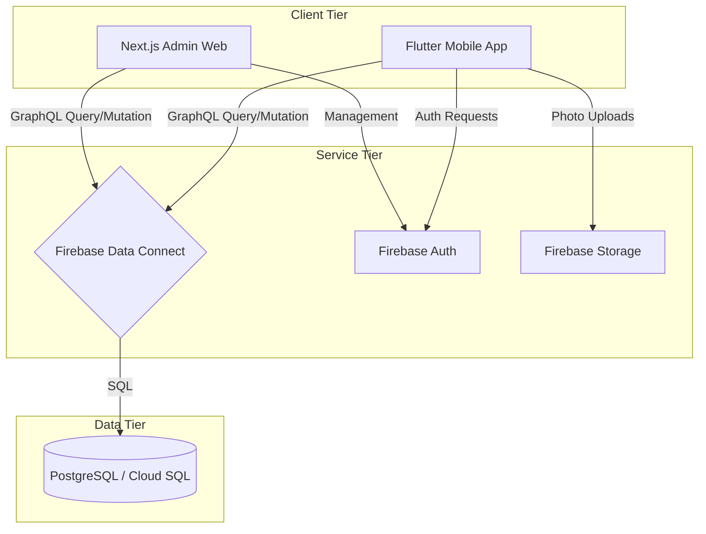

# 🚚 JNE Martapura - Integrated Attendance System 📍

[](https://flutter.dev)
[](https://nextjs.org)
[](https://firebase.google.com)
[](https://www.postgresql.org)

**JNE Martapura Attendance System** is an enterprise-grade ecosystem designed for high-efficiency workforce management. It combines cutting-edge mobile biometrics with a high-performance web administrative dashboard, following the **"Zen Premium"** design philosophy.

---

## 📸 Visual Showcase

| Mobile Experience | Admin Dashboard |
| :---: | :---: |
|  |  |
| *Modern "Zen" Biometric Interface* | *Bento-UI Management Portal* |

---

## 🛠️ Tech Stack

| Component | Technology | Rationale |
| :--- | :--- | :--- |
| **Mobile App** |  | Cross-platform high-performance UI |
| **State Management** |  | Scalable and reactive state handling |
| **Admin Web** |  | SSR & optimized administrative routes |
| **Styling** |  | Rapid Bento-UI development |
| **Data Layer** |  | GraphQL bridge to PostgreSQL |
| **Database** |  | ACID-compliant relational storage |

---

## 🏗️ System Architecture

### 🗼 Zen Premium Command Center Architecture

Sistem ini dirancang dengan arsitektur **Closed-Loop Telemetry**, memastikan sinkronisasi presisi antara unit mobile (Karyawan) dan Command Tower (Admin).

#### 🏗️ Technology Stack

- **Command Dashboard:** Next.js + Tailwind CSS (Zen Premium UI)
- **Mobile Unit:** Flutter (Biometric & Geofencing)
- **Central Intelligence:** Firebase Firestore (NoSQL Real-time)
- **Authentication:** Firebase Auth (Secure Protocol)
- **Storage:** Firebase Storage (Biometric Evidence)

#### 📡 Operational Flow (GACOR Sync)

1. **Heartbeat Sync:** Mobile app mengirimkan sinyal "Heartbeat" setiap 30 detik ke `user_heartbeats`. Admin memantau status online secara real-time di Dashboard.
2. **Biometric Validation:** Absensi menggunakan verifikasi wajah yang tersimpan di Firebase Storage sebagai bukti operasional (Evidence).
3. **Geofencing Protocol:** Mobile app memvalidasi radius geofence (Haversine) sebelum mengizinkan transmisi data absensi.
4. **SOS Emergency Signal:** Sinyal darurat dikirimkan secara simultan ke `sos_alerts` (Live Dashboard) dan `adminNotifications` (History), memastikan respon cepat dari Tower Command.
5. **Offline Resiliency:** Jika sinyal hilang, data absensi disimpan secara lokal dan akan disinkronisasi secara otomatis saat koneksi kembali stabil (Auto-Sync Queue).

---

The following diagram illustrates the data flow between the mobile application, administrative portal, and the relational database backend via GraphQL.



---

## 📊 Database & API

### Relational Schema (fdcdb)

| Table | Description | Key Fields |
| :--- | :--- | :--- |
| **Users** | Employee profiles and roles | `uid`, `name`, `employeeId`, `faceRegistered` |
| **Attendance** | Daily check-in/out logs | `id`, `userId`, `attendanceDate`, `status` |
| **Leaves** | Time-off and sick requests | `id`, `userId`, `startDate`, `endDate` |
| **Shifts** | Work hours configuration | `id`, `name`, `checkInTime`, `tolerance` |

### Key GraphQL Operations

| Operation | Type | Description |
| :--- | :--- | :--- |
| `getAttendanceByDate` | Query | Retrieves all records for a specific workday. |
| `submitLeaveRequest` | Mutation | Submits a new time-off request for approval. |
| `updateUserShift` | Mutation | Updates an employee's assigned work hours. |
| `markNotificationRead` | Mutation | Updates the read status of admin alerts. |

---

## 📍 Advanced Geofencing Logic

To ensure accurate attendance, the mobile application implements the **Haversine Formula** for real-time distance calculation.

> [!NOTE]
> The calculation is performed on the client-side to provide instant feedback to the user before submitting to the backend.

- **Calculation**: `d = 2R × arcsin(√[sin²(Δφ/2) + cos(φ1)cos(φ2)sin²(Δλ/2)])`
- **Validation**: Attendance is only permitted if `d <= radius_limit` (typically 500m).

---

## 🎨 Zen Premium Style Guide

To maintain a "State of the Art" look, all UI components must follow these design tokens:

- **Dark Mode Background**: `#121826` (Deep Navy) - Avoids pure black.
- **Light Mode Background**: `#F8FAFC` (Off-White) - Soft on the eyes.
- **Primary Accent**: `#4F46E5` (Indigo) / `#22D3EE` (Cyan).
- **Call to Action**: `#FF6B00` (JNE Orange) - Strictly for priority buttons.

---

## 🚀 Getting Started

### Prerequisites

- **Flutter SDK**: Stable version.
- **Node.js**: 18+ version.
- **Firebase CLI**: Installed and logged in (`firebase login`).

### Quick Start

1. **Clone & Install**:

   ```bash
   cd user_mobile && flutter pub get
   cd admin && npm install
   ```

2. **Database Setup**:

   ```bash
   firebase deploy --only dataconnect
   ```

3. **Config**: Populate `.env` in `admin/` and add `google-services.json` to `user_mobile/`.

4. **Run Mobile**:

   ```bash
   flutter run
   ```

5. **Run Web**:

   ```bash
   npm run dev
   ```

---

## 📦 Production Deployment

### 1. Database & Schema

Before deploying clients, ensure the cloud database is synchronized:

```bash
firebase deploy --only dataconnect
```

### 2. Admin Dashboard (Next.js)

- **Platform**: [Vercel](https://vercel.com)
- **Configuration**:
    1. Connect GitHub repository.
    2. Add all `.env` variables in Vercel settings.
    3. Ensure `Authorized Domains` in Firebase Auth includes your Vercel URL.

### 3. Mobile App (Flutter)

- **Build Production APK**:

  ```bash
  cd user_mobile
  flutter build apk --release
  ```

- **Distribution**: Upload the generated APK in `build/app/outputs/flutter-apk/app-release.apk` to **Firebase App Distribution** or the **Google Play Console**.

---

## 🗺️ 2026 Future Roadmap

- 🤖 **AI Analytics**: Predictive analysis for late-coming patterns and workforce trends.
- 📶 **NFC Integration**: Physical tap-in support as a secure backup for GPS/Face.
- 📄 **Auto-Payroll**: Automated PDF generation for monthly performance and attendance reports.

---

## 🛠️ Troubleshooting

> [!IMPORTANT]
> **ProGuard Check**: If the app crashes in release mode, verify that `android/app/proguard-rules.pro` includes rules for Firebase and ML Kit.

### ❌ Undefined Class Errors

- **Fix**: Ensure `import '../models/app_models.dart';` is present at the top of the file.
- **Fix**: Run `flutter clean && flutter pub get` to reset the dependency cache.

---

Developed with ❤️ for **JNE Martapura**
