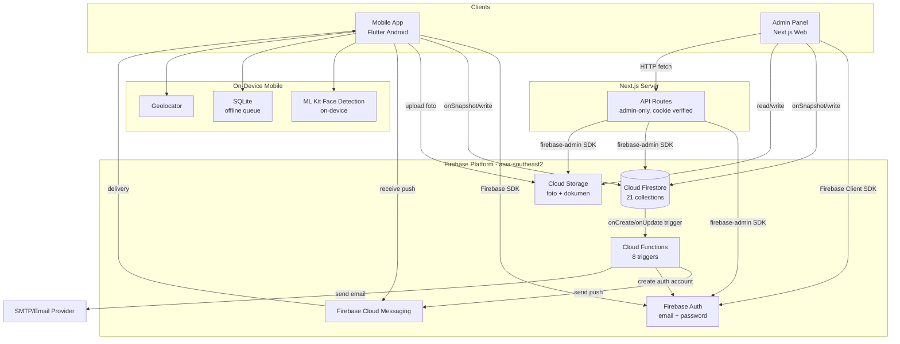
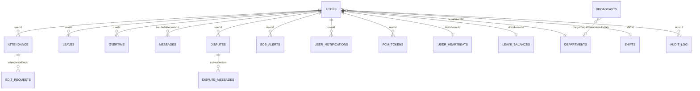
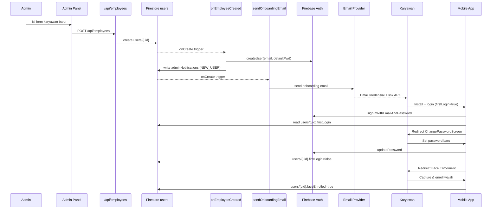
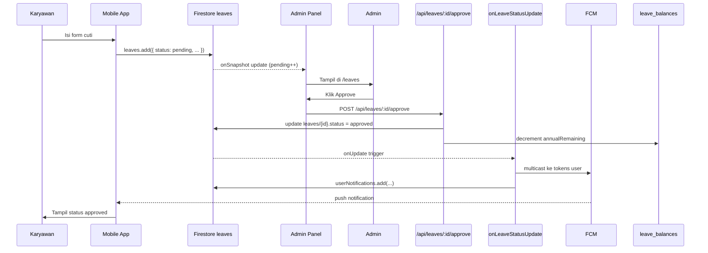
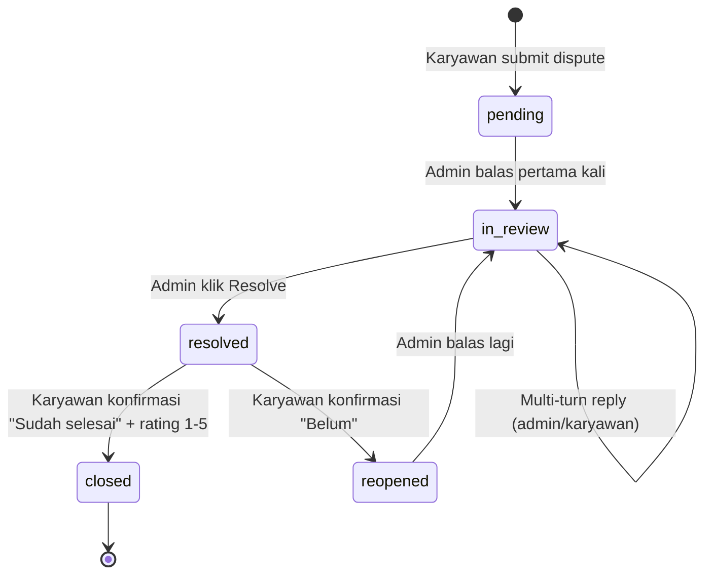
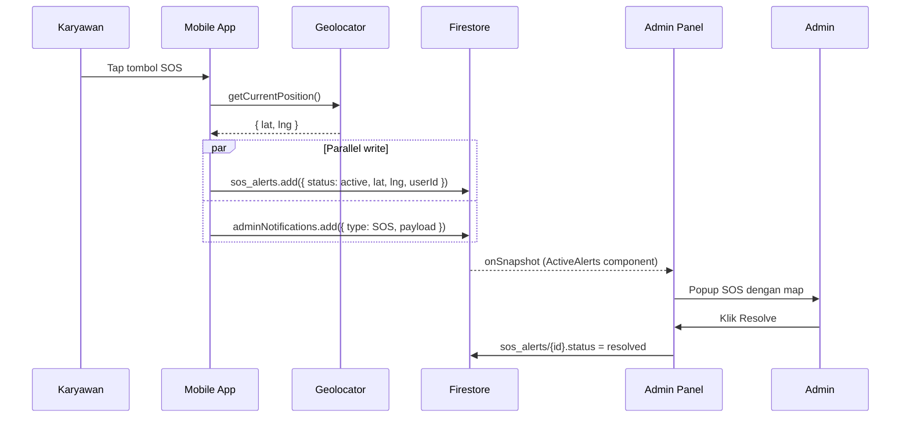
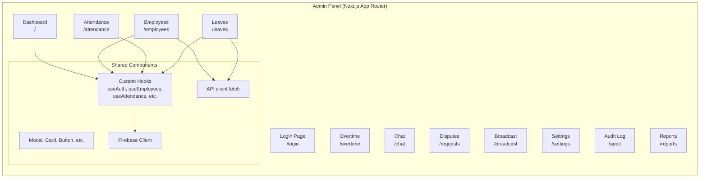
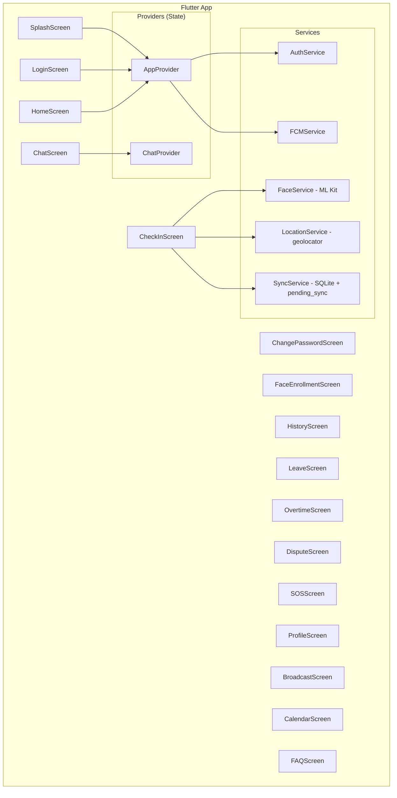
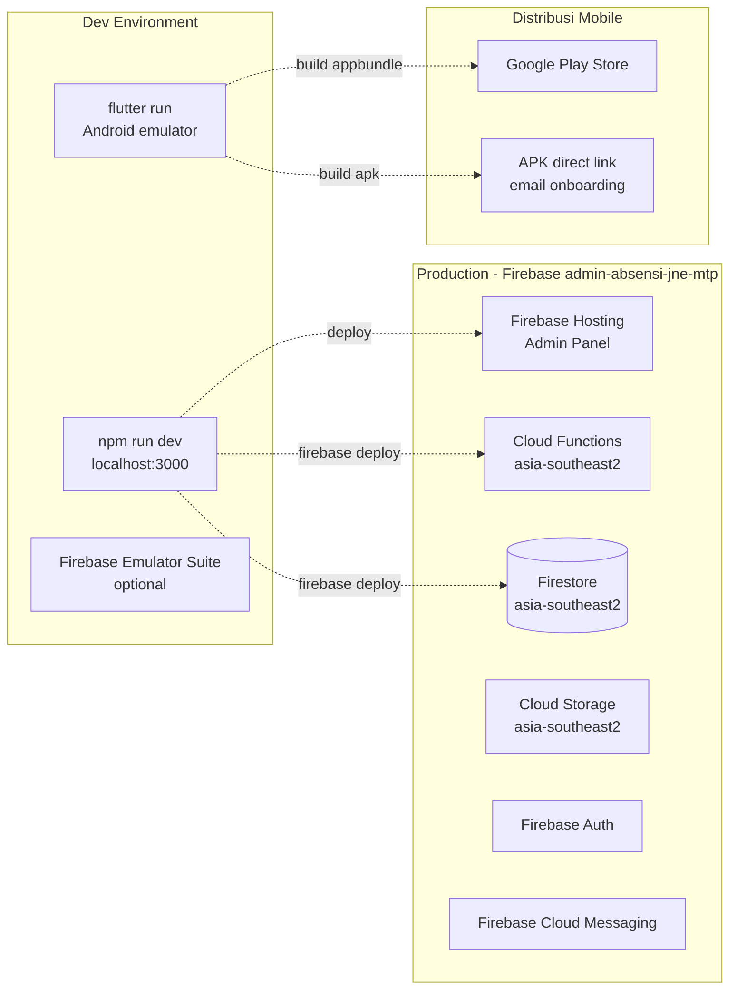

# Software Design Document (SDD)
## JNE Attendance System

**Versi:** 1.0
**Tanggal:** 30 Mei 2026
**Author:** Zainul Arkaan
**Status:** Active Development
**Referensi:** [PRD.md](PRD.md) v1.0 — 29 Mei 2026

> Dokumen ini adalah turunan teknis dari PRD v1.0. Setiap keputusan desain di sini wajib sinkron 100% dengan PRD. Bila terjadi konflik antara SDD dan PRD, PRD adalah sumber kebenaran.

---

## Daftar Isi

1. [System Architecture](#1-system-architecture)
2. [Tech Stack Recommendation](#2-tech-stack-recommendation)
3. [Database Design](#3-database-design)
4. [API Design & Integration](#4-api-design--integration)
5. [System Flow & Component Diagrams](#5-system-flow--component-diagrams)
6. [Security & Authentication](#6-security--authentication)
7. [Deployment Architecture](#7-deployment-architecture)
8. [Non-Functional Design Decisions](#8-non-functional-design-decisions)

---

## 1. System Architecture

### 1.1 Pola Arsitektur Utama: **Serverless Client–BaaS (Backend-as-a-Service)**

Sistem ini **bukan** monolith tradisional dan **bukan** microservices. Pola yang dipilih adalah **Client-Centric Serverless** dengan Firebase sebagai backbone BaaS, di mana:

- **Dua client aplikasi** (Mobile Flutter + Admin Web Next.js) berkomunikasi **langsung** ke Firestore lewat Firebase SDK.
- **Cloud Functions** berperan sebagai *event-driven workers* untuk side-effects yang tidak boleh dilakukan client (kirim email, generate Auth account, FCM push, kalkulasi terjadwal).
- **Next.js API Routes** berperan sebagai *admin-only server endpoints* untuk aksi yang perlu service-account privilege (misal: hapus user lain, reset password, ekspor data).
- **Firestore Security Rules** menjadi gateway otorisasi utama, dibantu cookie session untuk Admin Panel.

### 1.2 Alasan Pemilihan Arsitektur

| Alasan | Penjelasan |
|---|---|
| **Real-time native** | PRD §4.2 menuntut live attendance board, online presence, dan SOS popup — Firestore `onSnapshot` adalah solusi natif tanpa perlu WebSocket custom. |
| **Single source of truth** | Mobile dan admin membaca/menulis koleksi yang sama (`attendance`, `leaves`, dll) — menghindari sinkronisasi dua database. |
| **Offline-first di sisi mobile** | PRD §10.1 mewajibkan absensi tetap jalan offline. Firestore SDK + SQLite queue (`pending_sync`) sudah cukup tanpa server tambahan. |
| **Tim kecil, fokus produk** | Tidak perlu mengelola server, load balancer, message queue. Firebase Functions auto-scale ke region `asia-southeast2`. |
| **Auth terpusat** | Firebase Auth dipakai oleh mobile (langsung) dan admin (via verifikasi cookie) — satu identity provider. |

### 1.3 Komponen Tingkat Atas



### 1.4 Batas Tanggung Jawab Tiap Komponen

| Komponen | Tanggung Jawab | Bukan Tanggung Jawab |
|---|---|---|
| **Mobile App** | Capture wajah, geofence check, optimistic UI, offline queue, FCM token registration | Validasi role admin, mengelola data karyawan lain |
| **Admin Panel** | CRUD karyawan, monitoring real-time, approval workflow | Operasi yang butuh service account (delete auth user) |
| **API Routes** | Operasi privileged dengan service account, verify session cookie | Real-time listener (client melakukannya langsung ke Firestore) |
| **Cloud Functions** | Event-driven side effects (email, FCM, Auth account creation), scheduled jobs | Request/response sinkron untuk client (kecuali HTTPS callable `onAttendanceFailed`) |
| **Firestore Rules** | Otorisasi granular per koleksi & per field | Validasi business logic kompleks (didelegasikan ke Functions) |

---

## 2. Tech Stack Recommendation

Stack yang ditetapkan PRD §8 sudah optimal untuk kebutuhan proyek. SDD ini mempertegas peran tiap teknologi.

### 2.1 Mobile App (Flutter)

| Layer | Pilihan | Justifikasi |
|---|---|---|
| Framework UI | **Flutter ^3.10.4 (Dart)** | Single-codebase Android, hot reload mempercepat iterasi |
| State Management | **Provider pattern** (`AppProvider`, `ChatProvider`) | Cukup untuk skala app ini, kurva belajar landai |
| Backend SDK | **Firebase Core, Auth, Firestore, Storage, Messaging, Performance** | Native support, real-time, offline cache built-in |
| Face Detection | **`google_mlkit_face_detection`** | On-device, **tidak ada server call** — privasi & latensi optimal |
| Geolocation | **`geolocator`** + **`google_maps_flutter`** | Akurasi tinggi, dukungan permission Android lengkap |
| Offline Queue | **`sqflite` (SQLite)** | Lokal, transactional, untuk antrian `pending_sync` |
| Preferences | **`shared_preferences`** | Untuk tema, flag `firstLogin`, deviceId |
| UI Extras | **`google_fonts`**, **`animate_do`**, **`percent_indicator`**, **`cached_network_image`** | Konsistensi Zen Premium theme PRD §6.4 |
| Utilities | **`connectivity_plus`**, **`permission_handler`**, **`flutter_local_notifications`** | Mendeteksi koneksi untuk auto-sync, permission runtime, notif lokal |

### 2.2 Admin Panel (Next.js)

| Layer | Pilihan | Justifikasi |
|---|---|---|
| Framework | **Next.js 16.1.6 (App Router)** | SSR untuk verifikasi cookie, file-based routing, API routes built-in |
| UI | **React 19.2.3 + TypeScript 5** | Type-safe, ecosystem matang |
| Styling | **Tailwind CSS v4.2** | Utility-first untuk konsistensi tema Dark Crimson PRD §6.2 |
| Animation | **Framer Motion 12**, **anime.js 4** | Animasi premium subtle |
| Charts | **recharts** | Grafik tren kehadiran |
| Icons | **lucide-react** | Pure SVG, ringan, ribuan icon |
| Notifications | **sonner** (toast) | UX-friendly error/success message |
| Firebase Client | **firebase 12.9** | onSnapshot listener real-time |
| Firebase Server | **firebase-admin 12** | API routes dengan service account privilege |
| Font | **Plus Jakarta Sans** | Brand identity panel admin |

### 2.3 Backend (Firebase)

| Service | Pilihan | Justifikasi |
|---|---|---|
| Database | **Cloud Firestore (NoSQL)** | Real-time listener, region `asia-southeast2`, scale otomatis |
| Auth | **Firebase Authentication** (email + password) | Standar industri, dukungan token refresh otomatis |
| Storage | **Cloud Storage for Firebase** | CDN edge, integrasi SDK seamless dengan Auth |
| Push Notif | **Firebase Cloud Messaging (FCM)** | Channel `high_importance_channel` untuk Android |
| Functions | **Cloud Functions v1** (Node.js / TypeScript) | Trigger Firestore native, deploy regional |
| Email | **SMTP provider** (dipanggil dari `sendOnboardingEmail`) | Untuk kirim kredensial onboarding |
| Region | **`asia-southeast2` (Jakarta)** | Latensi <100ms dari Mataram |

### 2.4 Tooling Pendukung

| Kebutuhan | Tool |
|---|---|
| Source control | Git + GitHub |
| Package manager | npm (admin), pub (mobile) |
| Lint/Format | ESLint + Prettier (TS), `flutter analyze` + `dart format` |
| Deployment Functions | `firebase deploy --only functions` |
| Deployment Rules | `firebase deploy --only firestore:rules` |
| Mobile distribution | Play Store (production), APK download link (onboarding) |
| Admin distribution | Firebase Hosting |
| Seed scripts | Node.js scripts di `admin/scripts/*.mjs` |

---

## 3. Database Design

### 3.1 Catatan Konseptual

Firestore adalah **NoSQL document database**, jadi konsep di sini bukan "tabel/kolom/FK" tradisional tetapi **collection / document / field** dengan **referential integrity logic** dijaga di aplikasi & rules (bukan engine database). Tetap demikian, kolom `userId` di koleksi anak berfungsi sebagai **logical foreign key** ke `users/{uid}`.

**Doc ID Convention:**
- `users` → Firebase Auth UID
- `attendance` → `{userId}_{YYYY-MM-DD}` (deterministic untuk anti-duplikasi)
- `settings/system` → fixed id `system` (single doc)
- `user_heartbeats` → userId
- `leave_balances` → userId
- `fcm_tokens` → token string
- Lainnya → auto-generated ID

### 3.2 Skema Koleksi Lengkap (21 Koleksi)

#### `users` (Profil karyawan & admin)
| Field | Type | Keterangan |
|---|---|---|
| `uid` (docId) | string | Firebase Auth UID — **PK** |
| `email` | string | Email login (unique) |
| `personalEmail` | string | Untuk kirim onboarding email |
| `name` | string | Nama lengkap |
| `nik` | string | Nomor Induk Karyawan |
| `role` | enum | `superadmin` \| `admin` \| `kepala_unit` \| `karyawan` |
| `departmentId` | string | FK → `departments/{id}` |
| `shiftId` | string | FK → `shifts/{id}` |
| `position` | string | Jabatan |
| `photoUrl` | string | URL foto profil (Storage) |
| `faceEnrolled` | boolean | True bila wajah sudah didaftarkan |
| `faceData` | map | Vector/template wajah |
| `firstLogin` | boolean | True s/d ganti password pertama |
| `active` | boolean | Soft delete flag |
| `deviceId` | string | DeviceId terakhir untuk deteksi anomali |
| `createdAt` | timestamp | |
| `updatedAt` | timestamp | |

#### `attendance` (Record absensi harian)
| Field | Type | Keterangan |
|---|---|---|
| docId | string | `{userId}_{YYYY-MM-DD}` |
| `userId` | string | FK → `users/{uid}` |
| `date` | string | `YYYY-MM-DD` |
| `checkInTime` | timestamp | |
| `checkInPhoto` | string | URL Storage |
| `checkInLat`, `checkInLng` | number | Koordinat |
| `checkInFaceScore` | number | Skor face match |
| `checkOutTime` | timestamp | |
| `checkOutPhoto` | string | |
| `checkOutLat`, `checkOutLng` | number | |
| `status` | enum | `hadir` \| `terlambat` \| `tidak_hadir` \| `izin` |
| `workDurationMinutes` | number | |
| `overtimeMinutes` | number | Diisi `scheduledOvertimeCalc` |
| `syncedFromOffline` | boolean | Flag asal data |

#### `leaves` (Pengajuan cuti)
| Field | Type | Keterangan |
|---|---|---|
| docId | string | Auto |
| `userId` | string | FK → `users/{uid}` |
| `type` | enum | `tahunan` \| `sakit` \| `pribadi` \| `darurat` \| `lain` |
| `startDate`, `endDate` | string | `YYYY-MM-DD` |
| `reason` | string | |
| `documentUrl` | string | Lampiran (Storage) |
| `status` | enum | `pending` \| `approved` \| `rejected` |
| `reviewedBy` | string | FK → `users/{uid}` admin |
| `reviewedAt` | timestamp | |
| `rejectionReason` | string | |
| `createdAt` | timestamp | |

#### `overtime` (Pengajuan lembur)
| Field | Type | Keterangan |
|---|---|---|
| `userId` | string | FK → `users/{uid}` |
| `date` | string | |
| `hours` | number | |
| `reason` | string | |
| `status` | enum | `pending` \| `approved` \| `rejected` |
| `reviewedBy` | string | |
| `createdAt` | timestamp | |

#### `shifts` / `jamKerja` (Definisi jam kerja)
| Field | Type | Keterangan |
|---|---|---|
| `name` | string | Nama shift |
| `startTime` | string | `HH:mm` |
| `endTime` | string | `HH:mm` |
| `lateToleranceMinutes` | number | |
| `workDays` | array<int> | 0=Min … 6=Sab |

#### `departments`
| Field | Type | Keterangan |
|---|---|---|
| `name` | string | |
| `description` | string | |
| `headUserId` | string | FK → `users/{uid}` kepala unit |

#### `messages` (Chat flat admin ↔ karyawan)
| Field | Type | Keterangan |
|---|---|---|
| `senderId` | string | FK → `users/{uid}` |
| `receiverId` | string | FK → `users/{uid}` |
| `text` | string | |
| `attachmentUrl` | string | Optional |
| `read` | boolean | |
| `createdAt` | timestamp | |

#### `disputes` (Komplain karyawan)
| Field | Type | Keterangan |
|---|---|---|
| `userId` | string | FK → `users/{uid}` |
| `subject` | string | |
| `description` | string | |
| `status` | enum | `pending` \| `in_review` \| `resolved` \| `closed` \| `reopened` |
| `rating` | number | 1–5, diisi saat `closed` |
| `resolvedBy` | string | FK admin |
| `resolvedAt` | timestamp | |
| `createdAt` | timestamp | |

#### `disputes/{id}/messages` (Sub-collection thread)
| Field | Type | Keterangan |
|---|---|---|
| `senderId` | string | |
| `text` | string | |
| `createdAt` | timestamp | |

#### `sos_alerts` (Sinyal darurat)
| Field | Type | Keterangan |
|---|---|---|
| `userId` | string | FK → `users/{uid}` |
| `lat`, `lng` | number | Lokasi GPS |
| `status` | enum | `active` \| `resolved` |
| `resolvedBy` | string | |
| `createdAt` | timestamp | |

#### `broadcasts` (Pengumuman)
| Field | Type | Keterangan |
|---|---|---|
| `title` | string | |
| `body` | string | |
| `targetDepartmentId` | string | Null = semua |
| `createdBy` | string | FK admin |
| `createdAt` | timestamp | |

#### `events` / `calendarEvents` (Event kalender)
| Field | Type | Keterangan |
|---|---|---|
| `title` | string | |
| `description` | string | |
| `startAt`, `endAt` | timestamp | |
| `type` | enum | `holiday` \| `meeting` \| `event` |
| `createdBy` | string | FK admin |

#### `edit_requests` (Koreksi absensi)
| Field | Type | Keterangan |
|---|---|---|
| `userId` | string | FK |
| `attendanceDocId` | string | FK → `attendance/{id}` |
| `reason` | string | |
| `requestedCheckIn` / `requestedCheckOut` | timestamp | |
| `status` | enum | `pending` \| `approved` \| `rejected` |

#### `adminNotifications`
| Field | Type | Keterangan |
|---|---|---|
| `type` | enum | `SOS` \| `LEAVE` \| `FACE_FAIL` \| `NEW_USER` \| `DISPUTE` |
| `payload` | map | Data spesifik tipe |
| `read` | boolean | |
| `createdAt` | timestamp | |

#### `userNotifications`
| Field | Type | Keterangan |
|---|---|---|
| `userId` | string | FK |
| `title`, `body` | string | |
| `type` | string | |
| `read` | boolean | |
| `createdAt` | timestamp | |

#### `settings/system` (Single doc config)
| Field | Type | Keterangan |
|---|---|---|
| `office.lat`, `office.lng` | number | Koordinat kantor |
| `office.radiusMeters` | number | Geofence |
| `attendance.faceScoreThreshold` | number | |
| `attendance.maxFaceAttempts` | number | |
| `notifications.*` | map | Toggle per event |

#### `user_heartbeats` (Presence online)
| Field | Type | Keterangan |
|---|---|---|
| docId | string | userId |
| `lastSeen` | timestamp | Update setiap 30 detik |
| `online` | boolean | Derived dari `lastSeen` |

#### `fcm_tokens`
| Field | Type | Keterangan |
|---|---|---|
| docId | string | Token string |
| `userId` | string | FK |
| `platform` | string | `android` |
| `createdAt` | timestamp | |

#### `audit_log`
| Field | Type | Keterangan |
|---|---|---|
| `actorId` | string | FK admin |
| `action` | string | Misal `LEAVE_APPROVE` |
| `targetCollection` | string | |
| `targetId` | string | |
| `before`, `after` | map | Snapshot delta |
| `createdAt` | timestamp | |

#### `login_issues` (Laporan tanpa auth)
| Field | Type | Keterangan |
|---|---|---|
| `email` | string | |
| `nik` | string | |
| `description` | string | |
| `phone` | string | |
| `status` | enum | `pending` \| `resolved` |
| `createdAt` | timestamp | |

#### `pending_sync` (Sub-collection klien, di SQLite mobile)
> Berada di SQLite lokal, bukan Firestore. Skema disebutkan di sini untuk kelengkapan.

| Kolom (SQLite) | Type | Keterangan |
|---|---|---|
| `id` | INTEGER PK AUTOINCREMENT | |
| `kind` | TEXT | `attendance_in` \| `attendance_out` |
| `payload_json` | TEXT | Serialized payload |
| `local_photo_path` | TEXT | Path foto lokal |
| `created_at` | INTEGER | Epoch ms |

#### `leave_balances`
| Field | Type | Keterangan |
|---|---|---|
| docId | string | userId |
| `year` | number | |
| `annualTotal` | number | Saldo awal tahun |
| `annualUsed` | number | Sudah dipakai |
| `annualRemaining` | number | Derived |

### 3.3 Diagram Relasi Logis (ERD-style)



### 3.4 Composite Indexes (Wajib)

Sesuai PRD §7.4, deklarasikan di `firestore.indexes.json`:

```json
{
  "indexes": [
    { "collectionGroup": "attendance", "fields": [
        { "fieldPath": "userId", "order": "ASCENDING" },
        { "fieldPath": "date", "order": "DESCENDING" } ]},
    { "collectionGroup": "leaves", "fields": [
        { "fieldPath": "userId", "order": "ASCENDING" },
        { "fieldPath": "createdAt", "order": "DESCENDING" } ]},
    { "collectionGroup": "overtime", "fields": [
        { "fieldPath": "userId", "order": "ASCENDING" },
        { "fieldPath": "date", "order": "DESCENDING" } ]}
  ]
}
```

---

## 4. API Design & Integration

Sistem ini punya **tiga jenis API**:

1. **Firestore Client SDK** — komunikasi langsung client ↔ Firestore (read/write/listen). Bukan REST.
2. **Cloud Functions** — event-driven + HTTPS callable.
3. **Next.js API Routes** — RESTful, hanya untuk admin panel server-side.

### 4.1 Cloud Functions (8 Functions)

#### 4.1.1 `onEmployeeCreated`
- **Trigger:** Firestore `users/{uid}` `onCreate`
- **Input:** Document snapshot user baru
- **Aksi:**
  - Buat Firebase Auth account (`createUser({ email, password: defaultPwd, uid })`)
  - Tulis doc ke `adminNotifications` (type: `NEW_USER`)
- **Output:** Tidak ada response (background trigger)

#### 4.1.2 `sendOnboardingEmail`
- **Trigger:** Firestore `users/{uid}` `onCreate`
- **Input:** User document
- **Aksi:** Kirim email ke `personalEmail` berisi username, password sementara, link APK
- **Output:** Tidak ada response

#### 4.1.3 `onLeaveStatusUpdate`
- **Trigger:** Firestore `leaves/{id}` `onUpdate`
- **Kondisi:** `before.status === 'pending'` && `after.status` in (`approved`, `rejected`)
- **Aksi:** Multicast FCM ke semua token user, tulis ke `userNotifications`
- **Output:** Tidak ada response

#### 4.1.4 `onAttendanceCreated`
- **Trigger:** Firestore `attendance/{id}` `onCreate`
- **Aksi:** Processing tambahan (calculate `workDurationMinutes` saat check-out), audit log

#### 4.1.5 `onUserProfileUpdated`
- **Trigger:** Firestore `users/{uid}` `onUpdate`
- **Aksi:** Sync data (misal denormalize `name` ke `messages` jika diperlukan)

#### 4.1.6 `onFaceEnrolled`
- **Trigger:** Firestore `users/{uid}` `onUpdate`
- **Kondisi:** `before.faceEnrolled === false` && `after.faceEnrolled === true`
- **Aksi:** Tulis `adminNotifications` (type: `FACE_ENROLLED`)

#### 4.1.7 `onAttendanceFailed` (HTTPS Callable)
- **Trigger:** Dipanggil dari mobile saat face fail melewati `maxFaceAttempts`
- **Input:**
  ```json
  { "userId": "abc123", "attempts": 3, "lastScore": 0.42, "timestamp": "..." }
  ```
- **Aksi:** Tulis `adminNotifications` (type: `FACE_FAIL`), FCM ke admin
- **Output:**
  ```json
  { "ok": true }
  ```

#### 4.1.8 `scheduledOvertimeCalc`
- **Trigger:** PubSub schedule `cron: '0 23 * * *'` timezone `Asia/Jakarta`
- **Aksi:** Iterasi semua user aktif, baca attendance hari ini vs shift, hitung `overtimeMinutes`, update doc

### 4.2 Next.js API Routes (Admin-Only)

Semua route diawali `/api/`, **wajib** validasi cookie `jne_admin_session` + role check sebelum eksekusi.

| Method | Path | Body / Query | Response | Tujuan |
|---|---|---|---|---|
| `POST` | `/api/auth/login` | `{ email, password }` | `{ ok: true }` + Set-Cookie | Login admin |
| `POST` | `/api/auth/logout` | — | `{ ok: true }` | Clear cookie |
| `GET` | `/api/auth/me` | — | `{ uid, role, name }` | Cek session aktif |
| `POST` | `/api/employees` | `{ email, name, nik, departmentId, shiftId, position, personalEmail }` | `{ uid }` | Buat karyawan (trigger Cloud Function) |
| `PATCH` | `/api/employees/:uid` | partial user fields | `{ ok: true }` | Update profil |
| `DELETE` | `/api/employees/:uid` | — | `{ ok: true }` | Soft delete (`active: false`) |
| `POST` | `/api/employees/:uid/reset-password` | — | `{ tempPassword }` | Reset password + flag `firstLogin: true` |
| `POST` | `/api/employees/:uid/face-reset` | — | `{ ok: true }` | Reset `faceEnrolled: false` |
| `POST` | `/api/leaves/:id/approve` | `{ note?: string }` | `{ ok: true }` | Approve cuti (decrement saldo) |
| `POST` | `/api/leaves/:id/reject` | `{ reason: string }` | `{ ok: true }` | Reject cuti |
| `POST` | `/api/overtime/:id/approve` | — | `{ ok: true }` | Approve lembur |
| `POST` | `/api/overtime/:id/reject` | `{ reason: string }` | `{ ok: true }` | Reject lembur |
| `POST` | `/api/edit-requests/:id/approve` | — | `{ ok: true }` | Approve koreksi absensi |
| `POST` | `/api/edit-requests/:id/reject` | `{ reason: string }` | `{ ok: true }` | Reject koreksi |
| `POST` | `/api/disputes/:id/reply` | `{ text: string }` | `{ messageId }` | Balas dispute |
| `POST` | `/api/disputes/:id/resolve` | — | `{ ok: true }` | Tandai `resolved` |
| `POST` | `/api/broadcasts` | `{ title, body, targetDepartmentId? }` | `{ id }` | Kirim broadcast (multicast FCM) |
| `POST` | `/api/sos/:id/resolve` | — | `{ ok: true }` | Tandai SOS resolved |
| `GET` | `/api/reports/attendance` | `?from=YYYY-MM-DD&to=YYYY-MM-DD&dept=` | CSV stream | Export laporan |
| `POST` | `/api/settings/system` | partial config | `{ ok: true }` | Update `settings/system` |
| `GET` | `/api/audit-log` | `?from=&to=&actorId=` | `{ items: [...] }` | List audit log |
| `POST` | `/api/login-issues/:id/resolve` | — | `{ ok: true }` | Selesaikan laporan login |

### 4.3 Mobile App ↔ Firestore (Direct SDK Calls)

Tidak ada REST endpoint khusus untuk mobile. Operasi standar:

| Operasi | Pola SDK |
|---|---|
| Login | `FirebaseAuth.instance.signInWithEmailAndPassword(...)` |
| Cek `firstLogin` | `users/{uid}` `get()` → field `firstLogin` |
| Ganti password | `currentUser.updatePassword(newPwd)` + update `users/{uid}.firstLogin=false` |
| Enroll wajah | Upload template ke Storage + update `users/{uid}.faceEnrolled=true` |
| Check-in/out | Transaction: write `attendance/{uid}_{date}` + upload foto ke `Storage/attendance/{uid}/{date}_in.jpg` |
| Listen status | `firestore.collection('attendance').doc('{uid}_{today}').snapshots()` |
| Ajukan cuti | `leaves` `.add({ ... })` |
| Chat | `messages` `.add({ ... })` + listen `where('receiverId','==',uid)` |
| Dispute thread | `disputes/{id}/messages` `.add(...)` |
| SOS | Parallel `.add()` ke `sos_alerts` & `adminNotifications` |
| Heartbeat | Tiap 30 detik: `user_heartbeats/{uid}.set({ lastSeen: serverTimestamp() })` |
| FCM token | Register: `fcm_tokens/{token}.set({ userId, platform })` |

### 4.4 Error Contract Umum

API Routes mengembalikan error dengan format konsisten:

```json
{
  "ok": false,
  "error": {
    "code": "FORBIDDEN | NOT_FOUND | VALIDATION_ERROR | INTERNAL",
    "message": "Human readable message",
    "details": { /* optional */ }
  }
}
```

HTTP status: `400` (validation), `401` (no session), `403` (wrong role), `404` (resource), `500` (server).

---

## 5. System Flow & Component Diagrams

### 5.1 Onboarding Karyawan Baru



### 5.2 Alur Absensi Harian (Online + Offline Fallback)

```mermaid
flowchart TD
    A[Karyawan tap Absen Masuk] --> B{Cek GPS}
    B -- Diluar geofence --> X1[Tolak: error pesan]
    B -- Dalam radius --> C[Buka kamera + ML Kit]
    C --> D{Face score >= threshold?}
    D -- No, attempt < max --> C
    D -- No, attempt >= max --> X2[Callable: onAttendanceFailed]
    D -- Yes --> E{Online?}
    E -- Yes --> F[Upload foto ke Storage]
    F --> G[Firestore transaction:<br/>write attendance/{uid}_{date}]
    G --> H[Tampil konfirmasi Berhasil]
    E -- No --> I[SQLite: insert pending_sync]
    I --> J[Tampil konfirmasi Offline Tersimpan]
    K[connectivity_plus deteksi online] --> L[Drain pending_sync]
    L --> F
    G --> M[Admin dashboard live update via onSnapshot]
```

### 5.3 Alur Pengajuan & Approval Cuti



### 5.4 Alur Dispute Loop (Two-Way + Rating)



### 5.5 Alur SOS Emergency



### 5.6 Component Diagram — Admin Panel



### 5.7 Component Diagram — Mobile App



---

## 6. Security & Authentication

### 6.1 Strategi Otentikasi

**Single identity provider:** Firebase Authentication (email + password).

| Client | Mekanisme Auth |
|---|---|
| Mobile App | `FirebaseAuth.instance` langsung — ID token disimpan SDK |
| Admin Panel — Browser | Firebase Auth Client SDK + exchange ID token → HTTP-only cookie `jne_admin_session` |
| Admin Panel — API Routes | Verifikasi cookie dengan `firebase-admin.verifyIdToken()` + role check ke `users/{uid}` |

### 6.2 Admin Session Flow

```mermaid
sequenceDiagram
    participant Browser
    participant LoginPage as /login
    participant AuthSDK as Firebase Auth (client)
    participant API as /api/auth/login
    participant AdminSDK as firebase-admin
    participant FS as Firestore users

    Browser->>LoginPage: Input email + password
    LoginPage->>AuthSDK: signInWithEmailAndPassword
    AuthSDK-->>LoginPage: idToken
    LoginPage->>API: POST /api/auth/login (Bearer idToken)
    API->>AdminSDK: verifyIdToken(idToken)
    AdminSDK-->>API: { uid }
    API->>FS: get users/{uid}
    FS-->>API: { role }
    alt role in [admin, superadmin, kepala_unit]
        API-->>Browser: Set-Cookie: jne_admin_session=<sessionCookie>; HttpOnly; Secure; SameSite=Lax
    else
        API-->>Browser: 403 FORBIDDEN
    end
```

**Cookie properties:**
- `HttpOnly` — tidak bisa diakses JS (anti-XSS theft)
- `Secure` — hanya HTTPS
- `SameSite=Lax` — anti-CSRF dasar
- `Max-Age` — mengikuti Firebase session cookie (default 5 hari, refreshable)

### 6.3 Firestore Security Rules (Pola)

```javascript
rules_version = '2';
service cloud.firestore {
  match /databases/{db}/documents {

    // Helper functions
    function isAuth() { return request.auth != null; }
    function uid() { return request.auth.uid; }
    function role() {
      return get(/databases/$(db)/documents/users/$(uid())).data.role;
    }
    function isAdmin() {
      return role() == 'admin' || role() == 'superadmin';
    }
    function isOwner(userId) { return uid() == userId; }

    // ===== users =====
    match /users/{userId} {
      allow read:  if isAuth() && (isOwner(userId) || isAdmin());
      allow create: if isAdmin();
      allow update: if isOwner(userId) || isAdmin();
      allow delete: if false; // soft delete only
    }

    // ===== attendance =====
    match /attendance/{docId} {
      allow get:    if isAuth();  // longgar untuk transaction
      allow list:   if isAuth() && (resource.data.userId == uid() || isAdmin());
      allow create: if isAuth() && request.resource.data.userId == uid();
      allow update: if isAdmin();
      allow delete: if false;
    }

    // ===== leaves =====
    match /leaves/{id} {
      allow read:   if isOwner(resource.data.userId) || isAdmin();
      allow create: if isAuth() && request.resource.data.userId == uid()
                    && request.resource.data.status == 'pending';
      allow update: if isAdmin();
    }

    // ===== messages (chat) =====
    match /messages/{id} {
      allow read:   if isAuth() && (resource.data.senderId == uid()
                                  || resource.data.receiverId == uid()
                                  || isAdmin());
      // Block employee ↔ employee — salah satu sisi harus admin
      allow create: if isAuth()
                    && request.resource.data.senderId == uid()
                    && (isAdmin()
                        || get(/databases/$(db)/documents/users/$(request.resource.data.receiverId)).data.role == 'admin');
      // Update read flag — receiver atau admin
      allow update: if isAuth() && (resource.data.receiverId == uid() || isAdmin());
    }

    // ===== disputes + sub-collection =====
    match /disputes/{id} {
      allow read:   if isOwner(resource.data.userId) || isAdmin();
      allow create: if isAuth() && request.resource.data.userId == uid();
      allow update: if isOwner(resource.data.userId) || isAdmin();

      match /messages/{msgId} {
        allow read:   if isOwner(get(/databases/$(db)/documents/disputes/$(id)).data.userId) || isAdmin();
        allow create: if isAuth();
      }
    }

    // ===== sos_alerts =====
    match /sos_alerts/{id} {
      allow read:   if isAdmin() || isOwner(resource.data.userId);
      allow create: if isAuth() && request.resource.data.userId == uid();
      allow update: if isAdmin();
    }

    // ===== login_issues — TANPA AUTH (special case) =====
    match /login_issues/{id} {
      allow read:   if isAdmin();
      // Validasi ketat field karena unauth
      allow create: if request.resource.data.keys().hasOnly(
                        ['email','nik','description','phone','status','createdAt'])
                    && request.resource.data.status == 'pending'
                    && request.resource.data.email is string
                    && request.resource.data.description.size() <= 2000;
      allow update: if isAdmin();
    }

    // ===== admin-only sensitif =====
    match /audit_log/{id}      { allow read, write: if isAdmin(); }
    match /fcm_tokens/{token}  { allow read: if isAdmin();
                                  allow write: if isAuth() && request.resource.data.userId == uid(); }
    match /leave_balances/{uid} { allow read: if isOwner(uid) || isAdmin();
                                   allow write: if isAdmin(); }

    // ===== settings =====
    match /settings/{doc} {
      allow read:  if isAuth();
      allow write: if isAdmin();
    }

    // ===== default deny =====
    match /{document=**} {
      allow read, write: if false;
    }
  }
}
```

### 6.4 Storage Security Rules

```javascript
service firebase.storage {
  match /b/{bucket}/o {
    // Foto absensi: pemilik bisa upload, pemilik & admin bisa baca
    match /attendance/{userId}/{file} {
      allow read:  if request.auth != null
                    && (request.auth.uid == userId || isAdminClaim());
      allow write: if request.auth != null && request.auth.uid == userId
                    && request.resource.size < 5 * 1024 * 1024
                    && request.resource.contentType.matches('image/.*');
    }

    // Dokumen cuti
    match /leaves/{userId}/{file} {
      allow read:  if request.auth != null
                    && (request.auth.uid == userId || isAdminClaim());
      allow write: if request.auth != null && request.auth.uid == userId;
    }

    // Foto profil
    match /profile/{userId}/{file} {
      allow read:  if request.auth != null;
      allow write: if request.auth != null && request.auth.uid == userId;
    }
  }
}
```

> `isAdminClaim()` mengandalkan **custom claim** `admin: true` yang di-set saat user dipromosikan jadi admin (via Cloud Function atau script `setup_admin.mjs`).

### 6.5 Anti-Fraud Layered Defense untuk Absensi

| Lapisan | Mekanisme |
|---|---|
| 1. Geofence | GPS lat/lng dicek terhadap `settings/system.office.{lat,lng,radiusMeters}` |
| 2. Face Recognition | ML Kit on-device, threshold dari `settings/system.attendance.faceScoreThreshold` |
| 3. Device Fingerprint | `users/{uid}.deviceId` — login dari device beda dicatat |
| 4. Deterministic Doc ID | `attendance/{uid}_{YYYY-MM-DD}` → mustahil double check-in di hari sama |
| 5. Server timestamp | `serverTimestamp()` mencegah klien spoof waktu |
| 6. Audit Trail | Semua aksi admin tercatat di `audit_log` |
| 7. Max attempt + alert | Lebih dari `maxFaceAttempts` → `onAttendanceFailed` callable → notif admin |

### 6.6 Data Protection

| Aspek | Implementasi |
|---|---|
| Data at rest | Firebase storage (Firestore + Cloud Storage) ter-enkripsi default oleh Google |
| Data in transit | TLS 1.2+ wajib di semua Firebase SDK |
| Password storage | Tidak ada — Firebase Auth handle hash (scrypt) |
| Foto wajah template | Disimpan di `users/{uid}.faceData` (akses ketat lewat rules) |
| Logout cleanup | Mobile: clear SQLite `pending_sync`, hapus `fcm_tokens/{token}`, clear SharedPreferences sensitif |
| Session expiry | Cookie admin mengikuti Firebase session cookie (default 5 hari, dapat refresh) |

### 6.7 Threat Model Singkat

| Ancaman | Mitigasi |
|---|---|
| **XSS** mencuri token | Cookie `HttpOnly`, sanitasi user-generated content di React |
| **CSRF** ke API admin | `SameSite=Lax` + verifikasi `Origin` header di API routes |
| **GPS spoofing** | Kombinasi geofence + face — tidak cukup satu saja |
| **Replay foto lama** | Foto baru diambil setiap absen, ML Kit liveness opsional di future |
| **Brute force login** | Firebase Auth built-in rate limit |
| **Insider abuse admin** | `audit_log` immutable (rule: write-only by admin, no delete) |
| **Token FCM bocor** | Token expired dibersihkan otomatis di multicast callback |

---

## 7. Deployment Architecture



### 7.1 Script Deploy (referensi PRD §12.2)

```bash
# Admin panel
cd admin && npm run dev                     # dev
cd admin && npm run build && firebase deploy --only hosting

# Cloud Functions
cd admin/functions && firebase deploy --only functions

# Firestore rules & indexes
firebase deploy --only firestore:rules,firestore:indexes

# Storage rules
firebase deploy --only storage

# Seed data
node admin/scripts/seed_employees.mjs
node admin/scripts/seed_departments.mjs
node admin/scripts/setup_admin.mjs

# Mobile
cd user_mobile && flutter build appbundle --release
```

---

## 8. Non-Functional Design Decisions

### 8.1 Performance Budget (sesuai PRD §10.4)

| Metric | Target | Strategi |
|---|---|---|
| Admin dashboard cold load | < 3s | Next.js App Router + Tailwind purge + lazy import chart |
| Firestore listener latency | < 500ms | Region `asia-southeast2` dekat user |
| Mobile check-in online (4G) | < 15s | Foto JPEG compress ≤ 200KB sebelum upload |
| Mobile check-in offline | < 5s | SQLite insert sync, foto disimpan lokal di filesystem |
| Cloud Function cold start | < 3s | Minimasi dependency, gunakan v1 (lebih ringan utk trigger Firestore) |
| FCM delivery | < 10s | Multicast dengan limit batch 500 |

### 8.2 Reliability

- **Offline-first absensi:** SQLite `pending_sync` + listener `connectivity_plus` drain queue
- **Idempotency:** Doc ID `{userId}_{date}` mencegah double-write dari retry sync
- **Cloud Function retry:** Function trigger Firestore default retry on failure (idempotent design)
- **FCM token cleanup:** Token invalid dibuang dari `fcm_tokens` collection

### 8.3 Observability

- **Audit log:** Setiap mutasi admin lewat API routes wajib tulis `audit_log`
- **Firebase Performance Monitoring:** Aktif di mobile untuk trace check-in latency
- **Cloud Functions logs:** Default Cloud Logging
- **Login issues:** `login_issues` collection sebagai inbox masalah login non-auth

### 8.4 Scalability

- Firestore auto-scale; perhatikan **hotspot write** pada `user_heartbeats` (1 write per user per 30 detik) — masih jauh di bawah limit 500 writes/sec per document karena docId = userId (sharded by user).
- `messages` & `audit_log` bertumbuh — siapkan TTL policy (manual archive) bila > 1 juta dokumen.

### 8.5 Backward Compatibility & Future-Proofing

Sesuai out-of-scope PRD §11.2, **tidak ada** iOS, payroll, atau multi-cabang dalam scope. Desain tidak boleh menambah abstraksi prematur untuk fitur ini. Jika di masa depan diperlukan multi-office, kolom `office.lat/lng/radius` di `settings/system` perlu di-migrasikan ke koleksi `offices`.

---

## Lampiran A — Mapping PRD ↔ SDD

| PRD Section | SDD Section |
|---|---|
| §1 Overview | §1 System Architecture |
| §4 Fitur Utama | §4 API Design + §5 Flows |
| §5 User Flow | §5 System Flow Diagrams |
| §6 Design & UI/UX | (di luar scope SDD — lihat PRD) |
| §7 Database Overview | §3 Database Design |
| §8 Tech Stack | §2 Tech Stack Recommendation |
| §9 Security & Permissions | §6 Security & Authentication |
| §10 Technical Requirements | §8 Non-Functional Design Decisions |
| §11 Scope | §8.5 Backward Compatibility |
| §12 Deployment | §7 Deployment Architecture |

---

*Dokumen ini adalah living document — diperbarui setiap kali PRD berubah atau ada keputusan teknis baru. Selama PRD masih final, SDD tidak boleh menyimpang dari isinya.*
